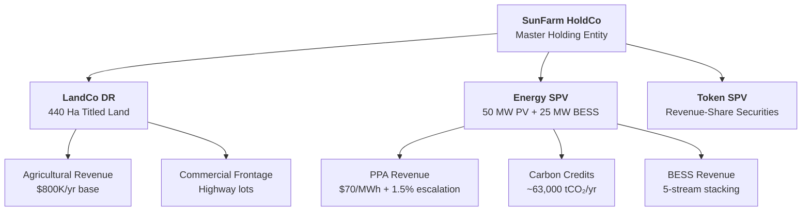
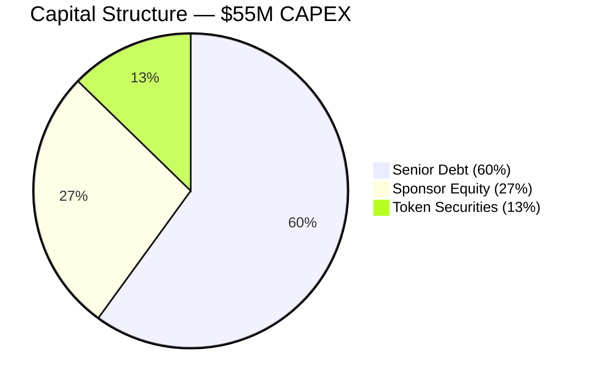
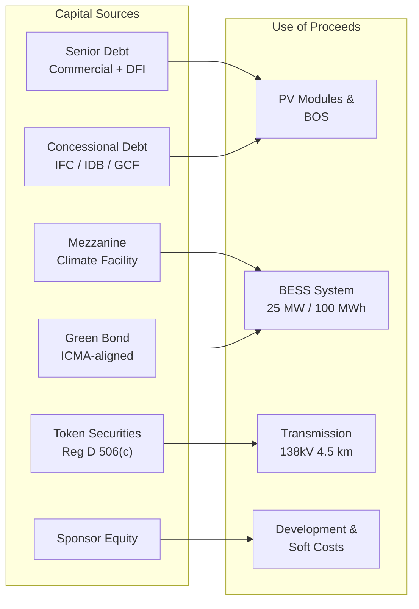
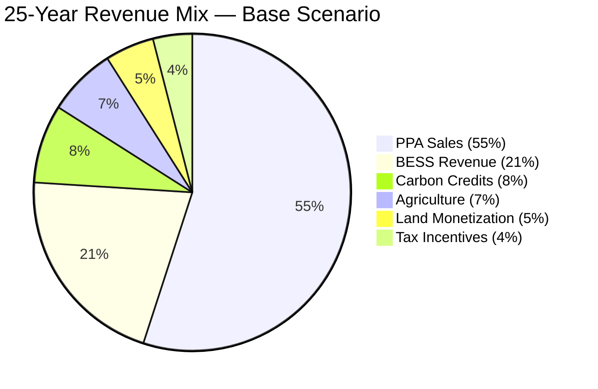
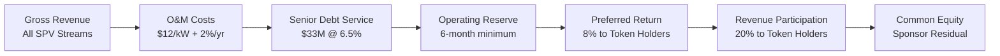
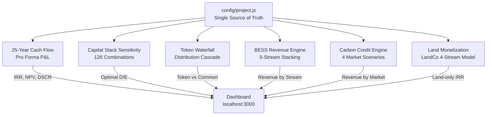
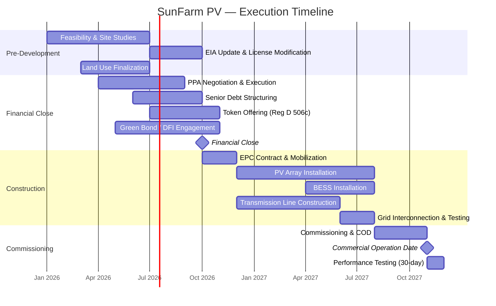
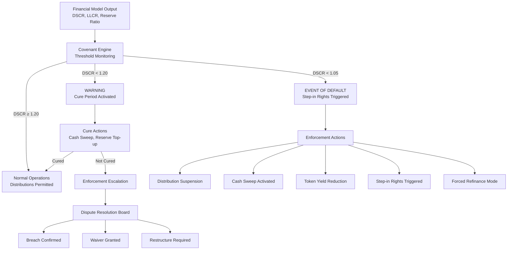
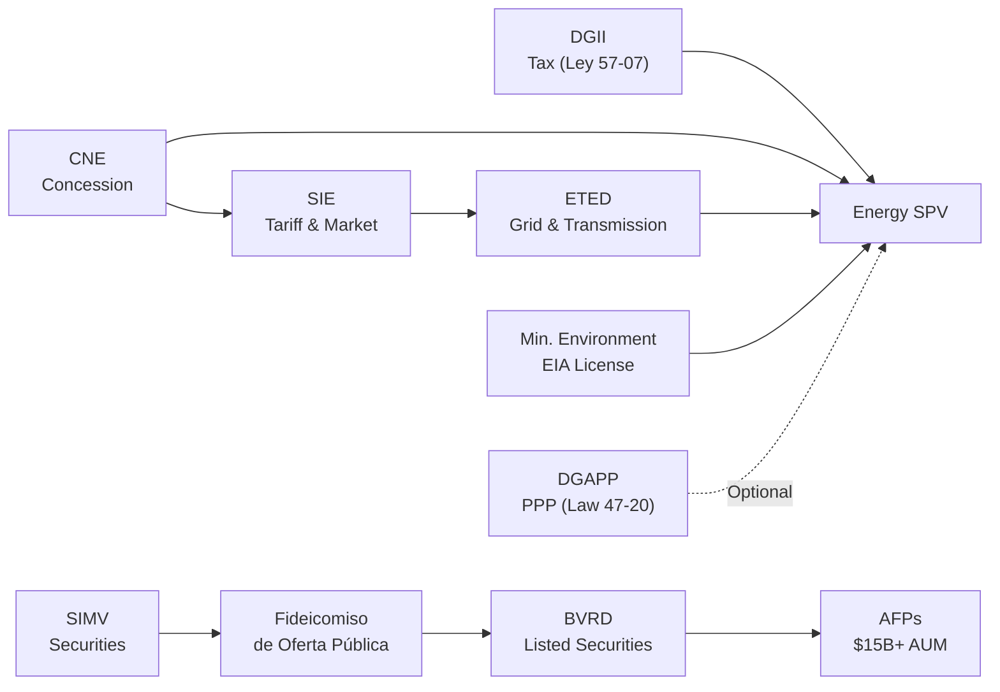

# SunFarm Platform

**Institutional-Grade Solar Infrastructure & Capital Orchestration Engine**

> **Classification: CONFIDENTIAL — Qualified Investors, Credit Committees, and Diligence Counsel Only**


| | |
|---|---|
| **Asset** | 50 MW AC / 59.69 MWp DC Bifacial PV + 25 MW / 100 MWh LFP BESS |
| **Location** | Baní, Peravia Province, Dominican Republic |
| **Land** | 440.68 hectares — titled, surveyed, no superposition |
| **Concession** | CNE-CP-0012-2020 — 25-year definitive |
| **Entity** | Sunfarming Dom Rep Invest, S.R.L. (RNC 1-31-94471-1) |

---

## Table of Contents

- [Executive Overview](#-executive-overview)
- [Asset Architecture](#-asset-architecture)
- [Capital Stack](#-capital-stack)
- [Revenue Engine](#-revenue-engine)
- [Tokenization Structure](#-tokenization-structure)
- [Financial Model Summary](#-financial-model-summary)
- [Risk Matrix](#-risk-matrix)
- [Data Room](#-data-room)
- [Implementation Timeline](#-implementation-timeline)
- [Capital Strategy](#-capital-strategy)
- [Governance & Enforcement](#-governance--enforcement)
- [Repository Structure](#-repository-structure)
- [Quick Start](#-quick-start)
- [Regulatory Status](#-regulatory-status)
- [DR Capital & Regulatory Stack](#-dominican-republic-capital--regulatory-stack)
- [Funding Pathways](#-funding-pathways)
- [Named Entities](#-named-entities)

---

## Executive Overview

SunFarm is a 50 MW utility-scale solar photovoltaic project with integrated 100 MWh battery energy storage, located on 440 hectares of titled land in Baní, Dominican Republic. The project holds a 25-year definitive concession from the Comisión Nacional de Energía and operates under an SPV architecture designed for institutional capital allocation.

All financial outputs are deterministic. Every number traces to an assumption in `config/project.js`. Every assumption traces to a source document.

### Summary Metrics

| Metric | Value |
|---|---|
| **Installed Capacity** | 50 MW AC / 59.69 MWp DC |
| **Module Technology** | Bifacial 760W, 78,500 modules |
| **BESS** | 25 MW / 100 MWh, 4-hour duration, LFP chemistry |
| **Land Area** | 440.68 hectares (4,406,824 m²) |
| **Concession** | 25 years, definitive (CNE-CP-0012-2020) |
| **Grid Interconnection** | 138kV double-circuit, 4.5 km to POI |
| **Total CAPEX** | $55,000,000 |
| **Year 1 Generation** | 105,120 MWh |
| **Year 1 Revenue** | $11.6M |
| **25-Year Revenue (Base)** | $397M |
| **Levered IRR (Base)** | 43.3% |
| **NPV @ 8%** | $81.7M |
| **Min DSCR (Base)** | 3.90x |
| **Equity Multiple** | 11.37x |
| **Payback Period** | 3 years |
| **CO₂ Avoided (Annual)** | ~63,000 tCO₂ |

### Scenario Comparison

| Parameter | Conservative | Base | Aggressive |
|---|---|---|---|
| Revenue Factor | 85% | 100% | 115% |
| Levered IRR | 34.1% | 43.3% | 52.3% |
| Min DSCR | 3.27x | 3.90x | 4.53x |
| Payback | ≤3 years | ≤3 years | ≤3 years |
| NPV @ 8% | — | $81.7M | — |

All scenarios maintain DSCR above 3.0x. No scenario approaches covenant breach territory.

---

## Asset Architecture

The project operates through a three-entity SPV structure designed to isolate land title risk from concession operations and revenue-share securities.



**Structural Rules**:

- Land title is held exclusively by LandCo. Title never enters Token SPV or Energy SPV.
- Token holders receive revenue participation rights only — no equity claims, no asset claims.
- Energy SPV holds the concession, PPA, and BESS operations.
- HoldCo consolidates governance and capital allocation across all three entities.
- LandCo leases land to Energy SPV under an arm's-length energy lease agreement.

---

## Capital Stack

### Target Capital Structure



### Baseline Terms

| Layer | Amount | Terms |
|---|---|---|
| **Senior Debt** | $33.0M | 6.5% interest, 18-year amortization, fully amortizing |
| **Sponsor Equity** | $15.0M | Target 40%+ IRR, first-loss position |
| **Token Securities** | $7.0M | 8% preferred return, 20% revenue participation |

### Sensitivity Analysis — Optimal Capital Structure

The capital stack sensitivity engine tests 42 combinations per scenario (7 debt/equity ratios x 6 interest rates x 3 scenarios = 126 total combinations).

| Structure | Interest Rate | Levered IRR | Min DSCR | Equity Multiple |
|---|---|---|---|---|
| 60/40 D/E | 6.5% | 43.3% | 3.90x | 11.37x |
| 70/30 D/E | 6.0% | 56.2% | 3.15x | 14.8x |
| 80/20 D/E | 5.5% | 78.8% | 3.15x | 22.1x |
| 50/50 D/E | 7.0% | 35.8% | 4.95x | 8.9x |

**Blended WACC (estimated)**: 7.5–8.5% depending on tax shield timing and concessional layer inclusion.

### Capital Stack Optimization



---

## Revenue Engine

### 25-Year Revenue Composition



### Revenue Stream Detail

| Stream | Year 1 | Escalation | 25-Year Total | Source |
|---|---|---|---|---|
| **PPA Sales** | $7.36M | 1.5%/yr | ~$207M | Energy SPV |
| **BESS Revenue** | $2.50M | 2.0%/yr | ~$80M | Energy SPV |
| **Carbon Credits** | $0.95M | 3.0%/yr | ~$32M | Energy SPV |
| **Agriculture** | $0.80M | 2.5%/yr | ~$27M | LandCo |
| **Land Monetization** | Variable | — | ~$20M | LandCo |
| **Tax Incentives** | Varies | — | — | Ley 57-07 |

### BESS Revenue Stacking (5 Streams)

| Stream | Year 1 Revenue | Description |
|---|---|---|
| Energy Arbitrage | $1.82M | Buy low / sell high cycling |
| Frequency Regulation | $1.10M | Ancillary grid services |
| Capacity Payments | $0.91M | Firm capacity commitments |
| Peak Shaving | $0.59M | Demand charge reduction |
| Curtailment Mitigation | $0.14M | Store curtailed generation |
| **Total** | **$4.56M** | **17.9% IRR, 481% ROI, 6-year payback** |

### Deterministic Model Assumptions

| Parameter | Value | Source |
|---|---|---|
| Capacity Factor | 24% | Site-specific irradiance study |
| PPA Rate | $70/MWh | Market comparable, USD-denominated |
| Annual Degradation | 0.4%/yr | Module manufacturer specification |
| Grid Emission Factor | 0.6 tCO₂/MWh | DR national grid average |
| Carbon Price | $15/tCO₂ | Verra VCS spot reference |
| O&M Cost | $12/kW/yr | Industry benchmark, 2% escalation |
| Insurance | $1.50/kW/yr | Included in operating costs |
| Tax Rate | 27% | DR corporate rate (exempt years 1-10) |

---

## Tokenization Structure

### Revenue Waterfall



### Token Economics

| Parameter | Value |
|---|---|
| **Total Raise** | $15,000,000 |
| **Token Count** | 150,000 |
| **Token Price** | $100 |
| **Minimum Investment** | $1,000 |
| **Preferred Return** | 8% per annum |
| **Revenue Participation** | 20% of net distributable cash |
| **Regulatory Framework** | Reg D 506(c) — accredited investors only |
| **Token IRR** | 13.5% |
| **Token Multiple** | 4.18x |
| **Token Payback** | 8 years |

### Stress Test Results

| Scenario | Token IRR | Token Multiple | Common IRR | Min DSCR |
|---|---|---|---|---|
| Base Case | 13.5% | 4.18x | — | 3.90x |
| Revenue -20% | 9.6% | — | — | — |
| CAPEX +15% | 11.2% | — | — | — |

Under -20% revenue stress, token holders still achieve positive returns above preferred threshold.

---

## Financial Model Summary

Six deterministic models consume from a single configuration source (`config/project.js`). Change assumptions once — all outputs update.



### Model Outputs

| Model | Key Output | Base Result |
|---|---|---|
| **25-Year Cash Flow** | Levered IRR, DSCR, NPV | 43.3% IRR, 3.90x DSCR, $81.7M NPV@8% |
| **Capital Stack** | Optimal structure | 80/20 @ 5.5% = 78.8% IRR |
| **Token Waterfall** | Token IRR, multiple | 13.5% IRR, 4.18x multiple |
| **BESS Revenue** | 25-year revenue, ROI | $134.2M revenue, 481% ROI |
| **Carbon Credits** | Revenue by standard | Verra $29.6M, Compliance $98.0M |
| **Land Monetization** | LandCo total value | $20.35M across 4 streams |

### DSCR Profile

Debt Service Coverage Ratio remains well above covenant levels across all scenarios and all years.

```
Year     DSCR (Base)
  1      ████████████████████████████████████████  4.52x
  3      ███████████████████████████████████████   4.41x
  5      ██████████████████████████████████████    4.30x
 10      ████████████████████████████████████      4.08x
 15      ████████████████████████████████          3.87x
 20      ██████████████████████████████            3.66x
 25      ████████████████████████████              3.47x
         ─────────────────────────────────
         1.0x  1.5x  2.0x  2.5x  3.0x  3.5x  4.0x  4.5x
         ▲ Covenant (1.20x)
```

All years remain above 3.0x — no scenario approaches the 1.20x covenant threshold.

---

## Risk Matrix

| # | Risk Category | Impact | Probability | Severity | Mitigation |
|---|---|---|---|---|---|
| 1 | Regulatory / concession modification | High | Low-Medium |  | Definitive concession, BIT protection, MIGA/DFC PRI |
| 2 | PPA counterparty default | High | Low-Medium |  | Creditworthy off-taker, revenue diversification (35% non-PPA) |
| 3 | Transmission / grid curtailment | Medium-High | Medium |  | ETED approval, BESS curtailment mitigation, alternative POI |
| 4 | BESS degradation / performance | Medium | Medium |  | LFP chemistry, 2%/yr conservative assumption, augmentation reserve |
| 5 | Carbon price volatility | Medium | Medium |  | Forward sale contracts, floor/ceiling structure |
| 6 | Construction delay | Medium | Medium |  | Fixed-price EPC, liquidated damages, experienced contractor |
| 7 | FX risk | Medium | Medium |  | USD-denominated PPA, USD revenue streams |
| 8 | Environmental / permitting | Low | Low |  | License 0379-20 granted, EIA approved |
| 9 | Land title dispute | Low | Low |  | No Superposición certified, catastro registered |
| 10 | Interest rate risk | Medium | Medium |  | Fixed-rate debt, sensitivity modeled across 6 rates |

Detailed risk analysis with full mitigation matrices available in `RISK-MEMO.md` (10 categories, 258 lines).

---

## Data Room

### Document Status

| Category | Document | Status | Reference |
|---|---|---|---|
| **Corporate** | Entity formation (Acta Constitutiva) |  | A-002 |
| **Corporate** | Registro Mercantil |  | A-001 |
| **Corporate** | SPV organizational chart |  | spv/ |
| **Land** | Certificación de No Superposición |  | B-001 |
| **Land** | Deslinde y Mensura (survey) |  | B-002 |
| **Land** | Catastro registration |  | B-003 |
| **Regulatory** | CNE definitive concession |  | C-001 |
| **Regulatory** | Environmental license 0379-20 |  | C-002 |
| **Grid** | ETED no-objection letter |  | D-001 |
| **Financial** | 25-year pro forma model |  | models/ |
| **Corporate** | Board resolutions (SPV creation) |  | A-004 |
| **Corporate** | Shareholder agreement |  | — |
| **Land** | Independent appraisal |  | — |
| **Financial** | PPA term sheet |  | — |
| **Technical** | BESS procurement specification |  | — |

Full diligence checklist: `data-room/diligence-checklist.md` (145 items across 8 categories)

---

## Implementation Timeline



### Key Milestones

| Milestone | Target Date | Dependency |
|---|---|---|
| Financial Close | Q4 2026 | PPA execution, debt commitment |
| Construction Start | Q4 2026 | Financial close, EPC contract |
| BESS Installation | Q2 2027 | Equipment procurement |
| Grid Interconnection | Q3 2027 | ETED coordination |
| Commercial Operation Date | Q4 2027 | Commissioning complete |

---

## Capital Strategy

The `capital/` module implements a full-spectrum capital raising architecture covering 12 funding pathways. Each pathway includes target counterparties, structuring logic, and financial modeling.

```mermaid
flowchart TD
    subgraph Debt["Debt Instruments"]
        GB["Green Bond<br/>ICMA-aligned"]
        SLL["Sustainability-Linked Loan<br/>KPI-adjusted margin"]
        ML["Multilateral Blended Finance<br/>IFC / IDB / DFC / GCF"]
        VF["Vendor Finance<br/>EPC deferred payment"]
    end

    subgraph Equity["Equity & Securities"]
        SE["Sponsor Equity"]
        TK["Token Securities<br/>Reg D 506(c)"]
        HB["Hybrid Token-Bond<br/>Digital bond wrapper"]
        SP["Sovereign Partner<br/>10-20% minority stake"]
    end

    subgraph Revenue["Revenue-Backed"]
        CF["Carbon Forward Sale<br/>5-7 year offtake"]
        BF["BESS-Specific Finance<br/>Storage SPV carve-out"]
        AG["Ag Impact Funding<br/>Grant blending"]
        YC["YieldCo Exit<br/>Year 5 drop-down"]
    end

    subgraph Protection["Risk Mitigation"]
        PRI["Political Risk Insurance<br/>MIGA / DFC / Private"]
    end

    GB --> PROJECT["SunFarm<br/>50 MW PV + 100 MWh BESS"]
    SLL --> PROJECT
    ML --> PROJECT
    VF --> PROJECT
    SE --> PROJECT
    TK --> PROJECT
    HB --> PROJECT
    SP --> PROJECT
    CF --> PROJECT
    BF --> PROJECT
    AG --> PROJECT
    YC --> PROJECT
    PRI --> PROJECT
```



### Capital Channels Summary

| Channel | Target Size | Counterparties | Status |
|---|---|---|---|
| Green Bond | $25-50M | IFC, IDB Invest, CAF, HSBC, BNP Paribas | Structuring |
| Sustainability-Linked Loan | $20-35M | Banco Popular, BanReservas, Scotiabank, Citi | Engagement |
| Multilateral Blended Finance | $15-30M | IFC, DFC, GCF, CIF, CDB, EIB | Engagement |
| Carbon Forward Sale | $5-12M | Microsoft, Shell, South Pole, BP | Pre-COD viable |
| BESS Carve-Out | $10-25M | Fluence, Tesla Energy, Generate Capital | Structuring |
| Token Securities | $15M | Accredited investors, Reg D 506(c) | Active |
| Sovereign Partner | $5-10M | CDEEE, EDESUR, Caribbean infra funds | Exploration |
| Political Risk Insurance | Full CAPEX | MIGA, DFC, Zurich, Chubb, Lloyd's | Quoting |

Full capital strategy documentation: `capital/`

---

## Governance & Enforcement

Phase III implements an institutional-grade covenant enforcement layer modeled on project finance credit agreement logic.



### Covenant Thresholds

| Covenant | Warning | Event of Default | Cure Period |
|---|---|---|---|
| DSCR | < 1.20x | < 1.05x | 90 days |
| LLCR | < 1.15x | < 1.00x | 90 days |
| Debt-to-Equity | > 80% | > 90% | 60 days |
| Reserve Ratio | < 3 months | < 1 month | 30 days |

### Enforcement Outcomes

- **Distribution Suspension**: Equity distributions halted, cash retained for debt service
- **Cash Sweep Activated**: Excess cash redirected to accelerated debt repayment
- **Token Yield Reduction**: Preferred return suspended, participation rights deferred
- **Step-in Rights**: Lender assumes operational control of Energy SPV
- **Forced Refinance**: Mandatory capital restructuring process initiated

Full governance module: `governance/`

Deterministic audit bundle export: `export/audit_bundle.js`

---

## Repository Structure

```
sunfarm-platform/
│
├── config/
│   └── project.js                    # Single source of truth — all models consume from here
│
├── models/
│   ├── 25-year-cashflow.js           # Pro forma: EBITDA, FCF, DSCR, IRR, NPV, payback
│   ├── capital-stack-sensitivity.js  # 126-combo D/E x interest rate x scenario matrix
│   ├── token-waterfall.js            # O&M → Debt → Reserve → Preferred → Common
│   ├── bess-revenue-engine.js        # 5-stream revenue stacking with scenario toggling
│   ├── carbon-credit-engine.js       # 4 market scenarios + forward sale analysis
│   └── land-monetization.js          # LandCo 4-stream model + land-only IRR
│
├── capital/
│   ├── green-bond/                   # ICMA-aligned green bond + TVRD + SPO + term sheet
│   ├── sustainability-linked-loan/   # KPI framework & margin ratchet modeling
│   ├── multilateral/                 # IFC/IDB/DFC/GCF engagement map + blended WACC
│   ├── dfi-blended/                  # Blended finance stack mechanics (IFC/IDB/DFC/GCF)
│   ├── fideicomiso/                  # DR trust securitization — overview, ringfence, term sheet
│   ├── ppp/                          # PPP Law 47-20 pathway assessment
│   ├── export-credit/                # ECA & vendor finance playbook
│   ├── carbon-forward/               # Offtake model + Verra VCS + forward term sheet
│   ├── bess-finance/                 # Storage SPV carve-out + equipment lease model
│   ├── vendor-finance/               # EPC deferred payment structuring
│   ├── sovereign-partner/            # Minority stake impact simulation
│   ├── political-risk/               # PRI structure + spread impact analysis
│   ├── impact-agriculture/           # Ag impact funding + grant blending
│   ├── hybrid-token-bond/            # Digital bond wrapper (Reg D / Reg S)
│   ├── yieldco-exit/                 # Year 5 drop-down valuation model
│   ├── capital-matrix.js             # Master WACC engine — all structures compared
│   └── outreach-tracker.json         # Institutional CRM — engagement status
│
├── governance/
│   ├── covenants.js                  # Financial covenant definitions & breach detection
│   ├── enforcement.js                # Cash waterfall rerouting & enforcement actions
│   ├── dispute_board.js              # Dispute resolution board logic
│   └── governance-adapter.js         # DAO-ready governance adapter (optional overlay)
│
├── export/
│   └── audit_bundle.js               # Deterministic audit bundle — hashed state export
│
├── spv/
│   ├── holdco/README.md              # Master holding entity governance
│   ├── landco/README.md              # Land asset holder — zone breakdown
│   ├── energy-spv/README.md          # Concession/PPA/BESS/carbon operations
│   └── token-spv/README.md           # Token issuance — waterfall, compliance
│
├── dashboard/
│   ├── server.js                     # Express server — 7 pages + 6 API endpoints
│   ├── routes/                       # Page & API route handlers
│   ├── components/                   # Layout, navigation, chart utilities
│   └── public/                       # Static assets
│
├── data-room/
│   ├── document-index.json           # All documents with status tracking
│   ├── diligence-checklist.md        # 145-item institutional diligence checklist
│   └── diligence-checklist-expanded.md # 87-item DR-specific expanded checklist (7 sections)
│
├── docs/
│   ├── index.html                    # GitHub Pages investor portal
│   ├── assets/                       # Portal styling
│   ├── legal/                        # Entity formation, concession, contracts
│   ├── regulatory/                   # CNE, SIE, Ley 57-07, TVRD, BESS compliance memos
│   ├── land/                         # Title, surveys, catastro
│   ├── environmental/                # EIA, licenses, monitoring
│   ├── financial/                    # Budgets, projections, term sheets
│   └── technical/                    # Engineering, grid studies, BESS specs
│
├── diagrams/
│   ├── dr-capital-plumbing-map.md    # All DR entities + capital channels (Mermaid)
│   ├── green-bond-issuance-workflow.md # ICMA + TVRD + SPO workflow (Mermaid)
│   ├── fideicomiso-workflow.md       # Trust cashflow → securities → investors (Mermaid)
│   └── seven-year-timeline-exit.md   # Gantt timeline + exit pathways (Mermaid)
│
├── scripts/
│   └── generate-report.js            # Consolidated report generator
│
├── source-documents/                 # Original project documents (A–F)
│
├── CAPITAL-STACK.md                  # Capital structure analysis
├── TOKENIZATION-STRUCTURE.md         # Token economics & legal framework
├── RISK-MEMO.md                      # 10-category risk matrix
└── PROJECT-SUMMARY.md                # One-page investor summary
```

---

## Quick Start

```bash
# Install dependencies
npm install

# Run individual models
npm run cashflow          # 25-year pro forma
npm run sensitivity       # Capital stack optimization
npm run waterfall         # Token distribution simulation
npm run bess              # BESS 5-stream revenue
npm run carbon            # Carbon credit scenarios
npm run land              # Land monetization

# Run all models
npm run all-models

# Generate consolidated report
npm run report

# Launch dashboard
npm start
# → http://localhost:3000

# Run capital matrix
npm run capital-matrix

# Export audit bundle
npm run audit-bundle
```

---

## Regulatory Status

| Approval | Authority | Status | Reference | Date |
|---|---|---|---|---|
| Definitive Concession | CNE | Granted | CNE-CP-0012-2020 | 2020 |
| Environmental License | Ministerio de Medio Ambiente | Granted | License 0379-20 | 2020 |
| Grid No-Objection | ETED | Approved | Revalidated | May 2025 |
| Land Title | Registro de Títulos | Registered | Cert. No Superposición | Oct 2024 |
| Tax Incentive Eligibility | DGII | Eligible | Ley 57-07 | Applicable |
| BESS Mandate Compliance | CNE | Required | Decreto 517-25 | 2025 |

### Applicable Legislation

- Ley General de Electricidad 125-01
- Ley 186-07
- Ley 57-07 (Renewable Energy Incentives — 10-year tax exemption)
- Decreto 202-08
- Decreto 717-08
- Decreto 517-25 (BESS mandate)

---

## Dominican Republic Capital & Regulatory Stack

SunFarm is **DR-native** — structured to access the full depth of Dominican Republic capital markets, regulatory frameworks, and sovereign incentive programs. This is not a generic "emerging market solar" project; every instrument, entity, and pathway below has been mapped to the specific DR institutional landscape.

### Regulatory Architecture



### Key DR Frameworks

| Framework | Authority | Relevance | Documentation |
|---|---|---|---|
| **Ley 57-07** | DGII / CNE | 10-year income tax exemption, import duty exemption, transfer tax relief | `docs/regulatory/Ley-57-07-Incentives-Applicability-Memo.md` |
| **Taxonomía Verde RD (TVRD)** | SIMV / Min. Environment | DR national green taxonomy — required for green-labeled issuance | `docs/regulatory/Taxonomia-Verde-RD-Alignment.md` |
| **Decreto 517-25** | CNE / SIE | Mandatory BESS for renewable projects — SunFarm compliant | `docs/regulatory/BESS-Compliance-Memo.md` |
| **Law 47-20** | DGAPP | PPP framework — optional pathway for infrastructure co-investment | `capital/ppp/PPP-Law-47-20-Pathway.md` |
| **Fideicomiso de Oferta Pública** | SIMV | DR-native securitization wrapper — access to AFPs ($15B+ AUM) | `capital/fideicomiso/Fideicomiso-Oferta-Publica-Overview.md` |

### DR Capital Market Access

The **fideicomiso de oferta pública** is the single most important DR-specific capital instrument. It enables:

- **AFP participation** — Dominican pension funds ($15B+ AUM) are the largest pool of long-duration capital in the country
- **BVRD listing** — public market liquidity for trust certificates
- **TVRD labeling** — green taxonomy compliance for ESG-mandated allocators
- **CEVALDOM custody** — central settlement infrastructure

**Precedent:** Larimar I (2022) — first TVRD-labeled green fixed-income security in DR capital markets.

---

## Funding Pathways

SunFarm implements **14 discrete funding channels**, each with specific counterparties, structuring, and documentation:

| # | Channel | Target Size | Key Counterparties | Documentation |
|---|---|---|---|---|
| 1 | **Green Bond (ICMA-aligned)** | $25–50M | IFC, IDB Invest, HSBC, BNP Paribas | `capital/green-bond/` |
| 2 | **Fideicomiso de Oferta Pública** | $15–30M | AFPs, DR insurance, BVRD, SIMV | `capital/fideicomiso/` |
| 3 | **Sustainability-Linked Loan** | $20–35M | Banco Popular, BanReservas, Scotiabank, Citi | `capital/sustainability-linked-loan/` |
| 4 | **Multilateral Blended Finance** | $15–30M | IFC, IDB Invest, DFC, GCF, CIF | `capital/multilateral/` + `capital/dfi-blended/` |
| 5 | **Export Credit / ECA** | $5–12M | Euler Hermes, SINOSURE, K-sure, DFC | `capital/export-credit/` |
| 6 | **Carbon Forward Sale** | $5–12M | Microsoft, Shell, South Pole, BP | `capital/carbon-forward/` |
| 7 | **BESS Carve-Out** | $10–25M | Fluence, Tesla Energy, Generate Capital | `capital/bess-finance/` |
| 8 | **Token Securities** | $15M | Accredited investors, Reg D 506(c) | `capital/hybrid-token-bond/` |
| 9 | **Vendor Finance** | $5–12M | LONGi, CATL, BYD, Fluence, Wärtsilä | `capital/export-credit/` + `capital/vendor-finance/` |
| 10 | **Sovereign Partner** | $5–10M | CDEEE, EDESUR, Caribbean infra funds | `capital/sovereign-partner/` |
| 11 | **Political Risk Insurance** | Full CAPEX | MIGA, DFC, Zurich, Chubb, Lloyd's | `capital/political-risk/` |
| 12 | **Ag Impact Funding** | $1–3M | USAID, GIZ, impact grants | `capital/impact-agriculture/` |
| 13 | **PPP Co-Investment** | TBD | DGAPP, Ministry of Energy, ETED | `capital/ppp/` |
| 14 | **YieldCo Exit** | $65–95M | Brookfield, CSAN, infrastructure secondaries | `capital/yieldco-exit/` |

Each channel has dedicated documentation, financial modeling, and/or term sheet templates.

---

## Named Entities

### DR Regulatory & Institutional

| Entity | Full Name | Role | Relevance |
|---|---|---|---|
| **CNE** | Comisión Nacional de Energía | Concession authority | Granted CNE-CD-003-2023 (25-year definitive) |
| **SIE** | Superintendencia de Electricidad | Electricity market regulator | SIE-119-2022-RCD recommendation; tariff oversight |
| **ETED** | Empresa de Transmisión Eléctrica Dominicana | Transmission system operator | 138kV POI; grid interconnection approval |
| **SIMV** | Superintendencia del Mercado de Valores | Securities regulator | Fideicomiso registration; green bond oversight |
| **DGAPP** | Dirección General de Alianzas Público-Privadas | PPP authority | Law 47-20 framework; optional co-investment |
| **DGII** | Dirección General de Impuestos Internos | Tax authority | Ley 57-07 tax exemption certification |
| **Min. Environment** | Ministerio de Medio Ambiente | Environmental authority | EIA License 0379-20; TVRD alignment |
| **BVRD** | Bolsa de Valores de la República Dominicana | Stock exchange | Fideicomiso certificate listing |
| **CEVALDOM** | Central de Valores Dominicana | Central custody | Settlement and custody of trust certificates |

### International / DFI

| Entity | Role | Relevance |
|---|---|---|
| **IFC** (World Bank) | Senior lender, equity co-investor, advisory | A/B loan, InfraVentures, blended concessional |
| **IDB Invest** | Senior lender, technical cooperation | A/B loan, CIF CTF channeling |
| **DFC** (U.S.) | Lender, political risk insurer | Direct loan + PRI dual role |
| **GCF** | Concessional capital, first-loss | Below-market debt, catalytic capital |
| **MIGA** (World Bank) | Political risk guarantor | Expropriation, transfer, political violence |
| **ICMA** | Green bond standards body | GBP June 2025 — framework compliance |
| **Verra** | Carbon registry | VCS project registration, VCU issuance |

### Project Entity

| Entity | RNC | Role |
|---|---|---|
| **Sunfarming Dom Rep Invest, S.R.L.** | 1-31-94471-1 | Operating company / concession holder |

---

## For Investors

| Document | Description | Location |
|---|---|---|
| **CAPITAL-STACK.md** | Full capital structure, waterfall, sensitivity analysis | Root |
| **TOKENIZATION-STRUCTURE.md** | Token economics, legal framework, projected returns | Root |
| **RISK-MEMO.md** | 10-category risk matrix with institutional mitigations | Root |
| **PROJECT-SUMMARY.md** | One-page summary for initial screening | Root |
| **capital/** | 12-channel capital strategy with counterparty targets | capital/ |

## For Diligence Teams

| Resource | Description | Location |
|---|---|---|
| **data-room/** | Document index with status tracking, 145-item checklist | data-room/ |
| **source-documents/** | Original regulatory, legal, land, and environmental docs | source-documents/ |
| **spv/** | Entity structure, governance, restrictions per SPV | spv/ |
| **models/** | Deterministic models with transparent assumptions | models/ |
| **governance/** | Covenant enforcement, dispute resolution | governance/ |
| **export/** | Deterministic audit bundle with state hashing | export/ |

---

## License

Proprietary. All rights reserved. This repository and its contents are confidential and intended solely for qualified investors, credit committees, and authorized diligence counsel.

---

*Built for institutional diligence. Every number traces to an assumption. Every assumption traces to a source document. Every covenant enforces capital discipline.*
