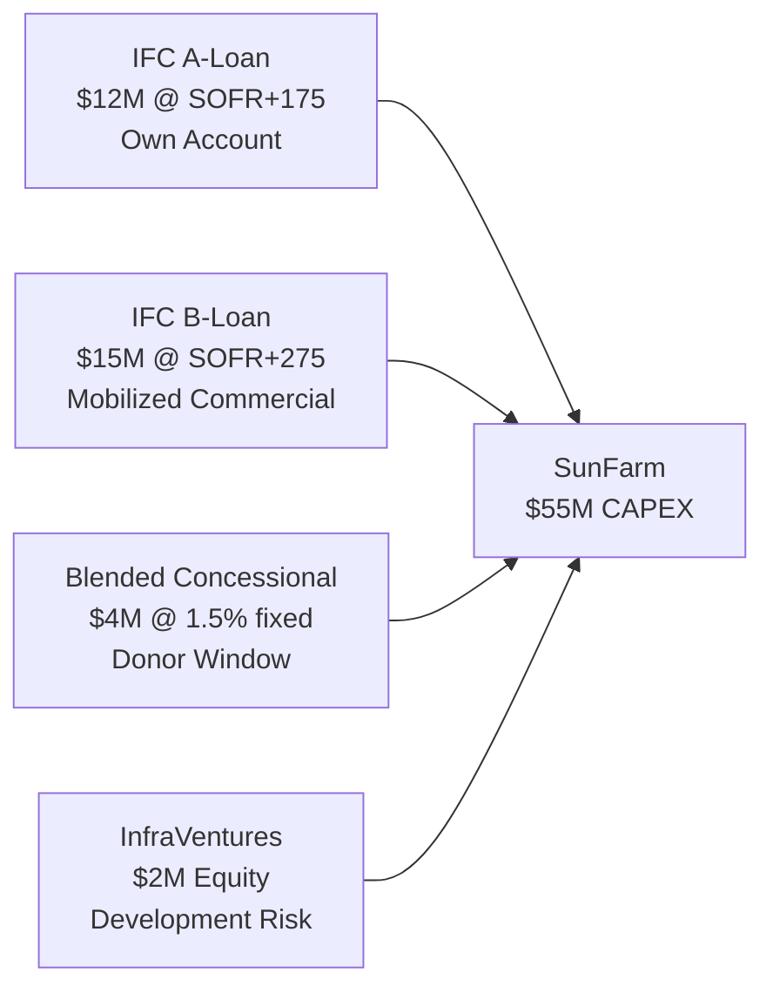
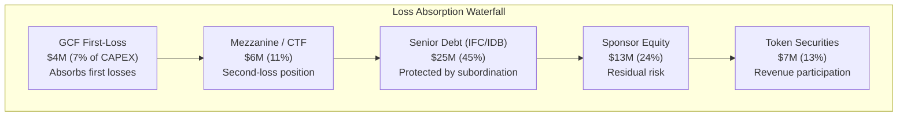

# IFC / IDB / DFC / GCF — Blended Finance Stack

> **Classification: CONFIDENTIAL — DFI Engagement Strategy**

## Overview

This document expands the multilateral engagement strategy (`engagement-map.md`) with **specific blended finance mechanics**: concessional tranche structuring, first-loss catalytic capital, and technical assistance grants relevant to SunFarm PV.

---

## Blended Finance Definition

Blended finance uses **catalytic capital from public or philanthropic sources** to increase private sector investment in sustainable development. Key elements:

| Component | Description | Example |
|---|---|---|
| **Concessional Tranche** | Below-market-rate debt from DFI | IFC A-loan at SOFR +150 bps vs. commercial at SOFR +325 |
| **First-Loss Capital** | Absorbs initial losses, protects senior investors | GCF 10% first-loss tranche |
| **Guarantees** | Risk sharing without capital deployment | MIGA political risk guarantee |
| **Technical Assistance** | Grant-funded project preparation or studies | CIF SREP grant for grid integration study |

---

## DFI-Specific Blended Structures

### IFC (International Finance Corporation)

| Product | Structure | Amount | Terms |
|---|---|---|---|
| **A-Loan** (own account) | Senior debt, IFC's own balance sheet | $10–15M | 15–18 yr, SOFR +150–200 bps |
| **B-Loan** (mobilized) | Senior debt, commercial banks under IFC umbrella | $10–20M | 12–15 yr, SOFR +250–300 bps |
| **MCPP** (Managed Co-Lending Portfolio) | Institutional investor co-investment | $5–15M | Matches A-loan terms |
| **InfraVentures** | Equity co-investment (early stage) | $1–5M | Equity; exits at financial close |
| **Blended Concessional Finance** | Below-market rates from donor pool | $3–5M | 20 yr, 0.5–2% fixed |

**IFC Blend Mechanics:**

### IDB Invest

| Product | Structure | Amount | Terms |
|---|---|---|---|
| **A-Loan** | Senior debt, IDB own account | $10–20M | 15–20 yr, competitive pricing |
| **B-Loan** | Mobilized commercial under IDB umbrella | $10–25M | 12–15 yr |
| **Subordinated Loan** | Junior tranche | $3–7M | Higher rate, longer tenor |
| **CIF CTF** (channeled via IDB) | Clean Technology Fund concessional | $5–10M | 20 yr, 0.25–0.75% |
| **Technical Cooperation** | Grant for project preparation | $200–500K | Non-reimbursable |

### DFC (U.S. International Development Finance Corporation)

| Product | Structure | Amount | Terms |
|---|---|---|---|
| **Direct Loan** | Senior or subordinated debt | $10–25M | Up to 25 yr |
| **Political Risk Insurance** | Coverage for expropriation, transfer, political violence | Up to full CAPEX | Annual premium |
| **Equity Investment** | Via fund vehicles | $1–5M | Minority stake |
| **Technical Assistance** | USAID-linked grants | $100–300K | Feasibility, E&S studies |

### GCF (Green Climate Fund)

| Product | Structure | Amount | Terms |
|---|---|---|---|
| **Concessional Loan** | Below-market senior or subordinated | $5–15M | 25 yr, 0–2%, 7-year grace |
| **Grant** | Non-reimbursable | $1–3M | Project preparation, TA |
| **First-Loss** | Catalytic capital layer | $3–5M | First 10% of losses absorbed |
| **Results-Based Payment** | Performance-linked disbursement | $1–5M | Linked to verified tCO₂ |

---

## Blend Mechanics: How Concessional Capital Reduces WACC

### Scenario Comparison

| Structure | WACC | IRR Impact | Key Enabler |
|---|---|---|---|
| **Commercial Only** (60/40 D/E, 6.5%) | 8.2% | Baseline 43.3% | — |
| **IFC A/B + Equity** | 7.1% | +3–5% IRR uplift | IFC halo effect on B-loan pricing |
| **IFC + CIF CTF Concessional** | 6.2% | +5–8% IRR uplift | CTF tranche at 0.75% pulls down blend |
| **Full Multilateral (IFC + IDB + GCF + DFC PRI)** | 5.4% | +8–12% IRR uplift | Maximum concessional + guarantee stack |

### First-Loss Structure

---

## Technical Assistance Grants

### Available Grant Facilities

| Facility | Source | Use | Amount |
|---|---|---|---|
| **Grid Integration Study** | CIF SREP / IDB TC | BESS integration, ancillary services design | $200–400K |
| **Environmental & Social Assessment** | IFC Advisory / DFC TA | Enhanced E&S framework, ESMS | $150–300K |
| **Carbon Market Preparation** | GCF Readiness / UNFCCC | Verra registration, MRV setup | $100–250K |
| **Gender & Community** | IDB TC / GCF | Gender action plan, community benefit sharing | $100–200K |
| **Financial Structuring** | IFC Advisory / CIF TA | Blended finance structuring, green framework | $100–200K |
| **Agrivoltaic Research** | USAID / GIZ | Agricultural co-use optimization | $100–200K |

> **Aggregate grant potential: $750K–$1.5M** — these are **non-dilutive** capital that reduces development risk and cost.

---

## Engagement Sequencing

| Phase | Timeline | DFIs | Activities |
|---|---|---|---|
| **1. Initial Outreach** | Month 1–2 | IFC, IDB Invest | Concept note, initial screening meetings |
| **2. Deep Engagement** | Month 2–4 | IFC, IDB, DFC | Detailed project presentations, site visits |
| **3. TA Applications** | Month 3–5 | CIF, GCF, IDB TC | Apply for technical assistance grants |
| **4. Mandate Letters** | Month 4–6 | IFC (lead), IDB (co-lead) | Engagement letters, due diligence kick-off |
| **5. Appraisal** | Month 6–10 | All engaged DFIs | Independent E&S review, financial model audit |
| **6. Board Approval** | Month 10–14 | IFC Board, IDB Board | Investment committee presentations |
| **7. Financial Close** | Month 14–16 | All parties | Loan agreements, disbursement conditions |

---

## Required Documentation for DFI Engagement

| Document | Status | Notes |
|---|---|---|
| **Project Information Document** | ⬜ To prepare | 20-page summary for initial screening |
| **Financial Model** | ✅ Complete | 25-year cash flow model with scenarios |
| **E&S Screening** | ✅ Partial (EIA exists) | May need enhanced ESMS per IFC PS |
| **Gender Action Plan** | ⬜ To prepare | Required by GCF, preferred by IFC |
| **Climate Risk Assessment** | ⬜ To prepare | Physical + transition risk per TCFD |
| **Procurement Plan** | ⬜ To prepare | Equipment sourcing, local content |
| **Corporate Structure** | ✅ Complete | SPV documentation in spv/ |
| **Land & Title** | ✅ Complete | No Superposición, catastro |
| **Concession** | ✅ Complete | CNE-CD-003-2023 |
| **Grid Study** | ⬜ To prepare | ETED coordination required |

---

*This document should be used alongside `multilateral/engagement-map.md` for comprehensive DFI strategy. The blending mechanics detailed here transform generic "we'll talk to IFC" into structured capital engineering.*
