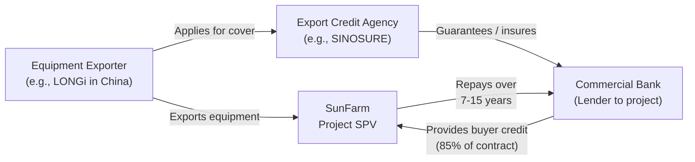

# ECA & Vendor Finance Playbook

> **Classification: CONFIDENTIAL — Procurement & Capital Structuring**

## Overview

Export Credit Agencies (ECAs) and vendor financing programs can reduce upfront equity requirements, lower blended cost of capital, and widen lender appetite — particularly when paired with political risk insurance.

---

## Equipment Categories & ECA Eligibility

### SunFarm CAPEX Components

| Component | Estimated Cost | Eligible for ECA? | Likely ECA Country |
|---|---|---|---|
| **PV Modules** (bifacial 760W) | $15–18M | ✅ Yes | Germany, China, South Korea, USA |
| **Inverters** (central/string) | $4–5M | ✅ Yes | Germany, Austria, China, USA |
| **BESS System** (100 MWh LFP) | $25M | ✅ Yes | China, South Korea, USA, Japan |
| **Substation & Transformers** | $3–4M | ✅ Yes | Germany, USA, Japan |
| **Structural / BOS** | $4–5M | ⚠️ Partial | Depends on origin |
| **EPC Services** | $3–4M | ⚠️ If foreign EPC | EPC contractor country |

---

## Target Export Credit Agencies

| ECA | Country | Products | Relevance |
|---|---|---|---|
| **Euler Hermes** (now Allianz Trade) | Germany | Buyer credit, supplier credit, guarantee | Modules (if European), inverters (SMA) |
| **SINOSURE** | China | Buyer credit, export seller's credit | Modules (LONGi, Trina, JA), BESS (CATL, BYD) |
| **K-sure** | South Korea | Medium-term buyer credit | BESS (Samsung SDI, LG Energy), modules (Hanwha) |
| **DFC** (U.S. International Development Finance Corporation) | USA | Direct loans, guarantees, political risk insurance | US-origin equipment; also provides PRI |
| **JBIC** (Japan Bank for International Cooperation) | Japan | Export credit, investment finance | Transformers, BESS (Panasonic) |
| **Bpifrance** | France | Export credit, guarantees | If French EPC contractor (e.g., Bouygues, Vinci) |

---

## Vendor Finance — Deferred Payment Structures

### Module Manufacturer Finance

| Vendor | Type | Typical Terms | Aggregate Potential |
|---|---|---|---|
| **LONGi Green Energy** | Deferred payment | 12–18 months post-delivery, 0–2% interest | $2–3M |
| **Trina Solar** | Supply agreement with extended payment | 180-day net (extendable) | $1.5–2.5M |
| **JA Solar** | Deferred + performance bond | 12 months, linked to COD | $1.5–2M |
| **Jinko Solar** | Volume-based credit terms | 120-day standard, 360-day negotiable | $1.5–2M |

### Inverter Finance

| Vendor | Type | Typical Terms |
|---|---|---|
| **SMA Solar** | Equipment lease or deferred payment | 12–24 months |
| **Huawei FusionSolar** | Competitive payment terms | 180-day net standard |
| **Sungrow** | Supplier credit available | 12 months post-delivery |

### BESS Vendor Finance

| Vendor | Type | Typical Terms | Potential |
|---|---|---|---|
| **CATL** | Deferred payment | 18–24 months, performance-linked | $3–5M |
| **BYD** | Flexible payment schedule | 12–18 months | $2–4M |
| **Fluence (Siemens/AES)** | Equipment lease | Operating or capital lease, 7–10 years | Full BESS value |
| **Tesla Megapack** | Direct purchase or lease | Payment at commissioning | Limited flexibility |
| **Wärtsilä** | EPC + finance package | Integrated BESS supply + financing | Full BESS value |

### EPC Contractor Finance

| Approach | Terms | Risk |
|---|---|---|
| **Deferred milestone payments** | 15–20% deferred to COD | Low — industry standard |
| **EPC equity participation** | EPC takes 5–10% equity stake, reducing cash requirements | Medium — alignment of interests |
| **Performance-linked payment** | Final 5–10% contingent on 30-day performance test | Low — standard |

---

## Aggregate Vendor Finance Potential

| Category | Low Estimate | High Estimate |
|---|---|---|
| Modules | $1.5M | $3.0M |
| Inverters | $0.5M | $1.0M |
| BESS | $2.0M | $5.0M |
| EPC Deferral | $1.5M | $3.0M |
| **Total** | **$5.5M** | **$12.0M** |

> At $5.5–12M of deferred payments, vendor finance can offset **10–22% of CAPEX** at financial close — materially reducing equity requirement.

---

## ECA Financing Structures

### Typical Structure

### Key Terms

| Parameter | Typical Range |
|---|---|
| **Coverage** | 85% of export contract value (OECD Consensus) |
| **Tenor** | 7–15 years (aligned with asset life) |
| **Interest Rate** | CIRR (Commercial Interest Reference Rate) — currently ~4–5% |
| **Premium** | 1–3% of covered amount (one-time) |
| **Grace Period** | Until COD + 6 months |
| **Down Payment** | 15% (not covered by ECA) |

### ECA + PRI Combination

| Combination | Impact |
|---|---|
| **ECA guarantee + MIGA PRI** | Maximum de-risking; opens widest lender universe |
| **ECA guarantee + DFC PRI** | U.S. policy alignment; DFC can provide both |
| **ECA alone** | Sufficient for many commercial lenders |

> **Spread impact:** ECA-backed debt typically prices **100–200 bps below** uncovered commercial debt.

---

## IRR Impact of Vendor / ECA Finance

| Scenario | Equity at Close | Sponsor IRR | DSCR Impact |
|---|---|---|---|
| **No vendor/ECA finance** | $22.0M (40%) | 43.3% | No change |
| **$5M vendor deferred** | $17.0M (31%) | ~52% | Slight improvement (lower initial debt) |
| **$10M vendor + ECA** | $12.0M (22%) | ~62% | Maintained above 3.0x |
| **$12M max vendor + ECA** | $10.0M (18%) | ~68% | Requires careful structuring |

> Vendor and ECA financing materially increase sponsor IRR by reducing equity contribution without increasing project-level interest rate.

---

## Action Items

- [ ] Issue RFPs to module suppliers requesting deferred payment terms
- [ ] Engage BESS vendors (Fluence, Wärtsilä, CATL) on integrated finance packages
- [ ] Contact relevant ECAs (Euler Hermes, SINOSURE, K-sure) based on equipment origin decision
- [ ] Explore DFC dual role: ECA-like financing + PRI for US-eligible components
- [ ] Structure EPC payment schedule with 15–20% deferral to COD
- [ ] Model blended WACC including ECA pricing advantage

---

*Vendor finance and ECA support are among the most overlooked capital optimization tools in project finance. The aggregate $5.5–12M reduction in upfront capital requirement significantly improves sponsor economics.*
