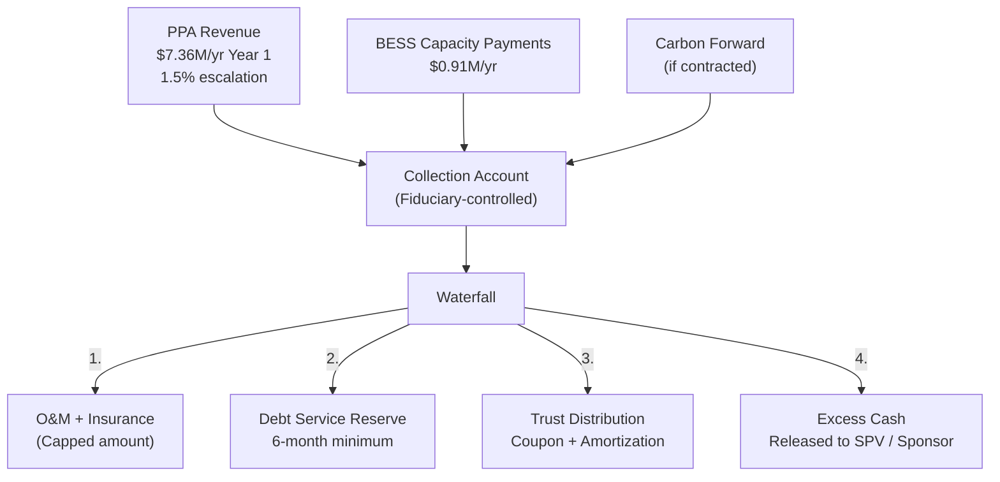

# Cash Flow Assignment & Ringfence Structure

> **Classification: CONFIDENTIAL — Structuring Document**

## Purpose

This document defines the cash flow assignment mechanics for a SunFarm fideicomiso issuance — specifically, which revenue streams are assigned to the trust, how they are ringfenced from sponsor risk, and what protections investors receive.

---

## Cash Flow Hierarchy

### Revenue Stream Eligibility

| Revenue Stream | Assignable to Trust? | Rationale |
|---|---|---|
| **PPA Revenue** | ✅ Primary candidate | Contracted, predictable, USD-denominated |
| **BESS Revenue (Capacity Payments)** | ✅ Yes (contracted portion) | Firm capacity contracts are bankable |
| **BESS Revenue (Merchant)** | ⚠️ Partial | Arbitrage and frequency regulation are market-dependent |
| **Carbon Credits** | ⚠️ Conditional | Forward contracted = yes; spot market = higher risk |
| **Agricultural Revenue** | ❌ Not recommended | Lower predictability, LandCo-specific |
| **Land Monetization** | ❌ Not recommended | Lumpy, non-recurring |

### Recommended Assignment Structure

---

## Ringfence Mechanisms

### Structural Protections

| Protection | Description |
|---|---|
| **Segregated Collection Account** | PPA off-taker pays directly to trust-controlled account |
| **Fiduciary Control** | Trust administrator controls all inflows and disbursements |
| **O&M Cap** | Operating expenses limited to budgeted amount (with inflationary allowance) |
| **Reserve Account** | 6-month debt service reserve funded at closing |
| **Excess Cash Trap** | If DSCR < 1.30x, excess cash retained in reserve (not released) |
| **Sponsor Non-Recourse** | Trust obligation is limited to assigned cash flows; no sponsor guarantee |
| **Step-in Rights** | Trust has right to step into O&M contract if performance deteriorates |

### DSCR Requirements

| Level | Action |
|---|---|
| **DSCR ≥ 1.50x** | Normal distribution + excess cash release to sponsor |
| **1.30x ≤ DSCR < 1.50x** | Distribution continues; excess cash trapped in reserve |
| **1.10x ≤ DSCR < 1.30x** | Cash sweep: 50% of excess to accelerated amortization |
| **DSCR < 1.10x** | Full cash sweep; no excess released; cure period triggered |

---

## Assigned Revenue Projections

### PPA Revenue Only (Conservative Assignment)

| Year | PPA Revenue | Trust DS | DSCR | Excess to Sponsor |
|---|---|---|---|---|
| 1 | $7,358,400 | $2,200,000 | 3.34x | $3,958,400 |
| 5 | $7,807,000 | $2,200,000 | 3.55x | $4,407,000 |
| 10 | $8,412,000 | $2,200,000 | 3.82x | $5,012,000 |
| 15 | $9,064,000 | $2,200,000 | 4.12x | $5,664,000 |

> *Assumes $20M fideicomiso at 8% coupon, 15-year amortization. PPA revenue alone provides 3.3x+ coverage.*

### PPA + BESS Capacity (Enhanced Assignment)

| Year | Combined Revenue | Trust DS | DSCR | Excess to Sponsor |
|---|---|---|---|---|
| 1 | $8,268,400 | $2,700,000 | 3.06x | $4,368,400 |
| 5 | $8,747,000 | $2,700,000 | 3.24x | $4,847,000 |
| 10 | $9,387,000 | $2,700,000 | 3.48x | $5,487,000 |

> *Enhanced assignment supports a larger issuance ($25M+) with maintained coverage.*

---

## Tax Considerations

### Trust-Level Taxation

| Item | Treatment | Notes |
|---|---|---|
| **Trust income** | May be subject to withholding | Depends on trust classification under DR tax code |
| **Distribution to investors** | Withholding at source | Rate depends on investor type (AFP, corporate, individual) |
| **AFP investors** | Potentially exempt or reduced rate | AFPs have favorable tax treatment on investment income |
| **Ley 57-07 interaction** | Must confirm | Tax exemption on project income vs. trust distribution income |

> ⚠️ **Action required:** DR tax counsel must confirm interaction between Ley 57-07 project-level income tax exemption and fideicomiso distribution-level withholding.

---

## Legal Documentation Required

| Document | Purpose |
|---|---|
| **Trust Agreement** (Contrato de Fideicomiso) | Defines trust terms, cash flow assignment, waterfall, covenants |
| **Cash Flow Assignment Agreement** | Legally assigns PPA receivables to trust |
| **Servicing Agreement** | O&M responsibilities and performance standards |
| **Account Control Agreement** | Fiduciary control over collection and distribution accounts |
| **Prospectus** | SIMV-required investor disclosure document |
| **Green Framework** | TVRD alignment documentation for green label |
| **SPO Report** | Second Party Opinion on green credentials |
| **Rating Report** | Local credit rating (Feller Rate or equivalent) |

---

*This structuring document is for internal planning. Final terms require DR securities counsel, fiduciary provider engagement, and SIMV consultation.*
