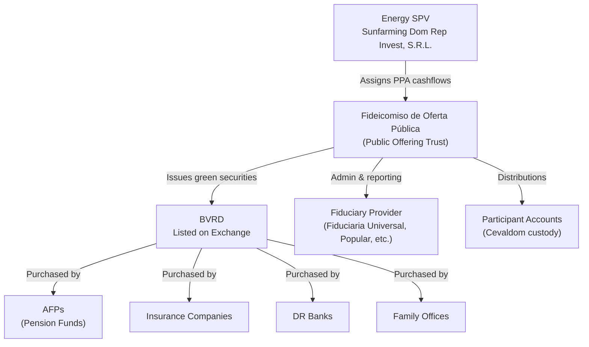
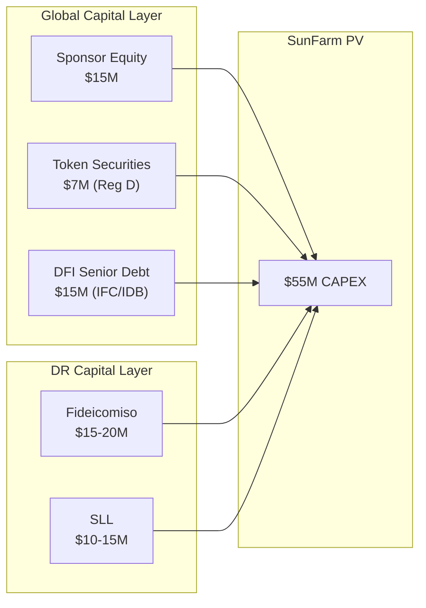

# Fideicomiso de Oferta Pública de Valores — Overview

> **Classification: CONFIDENTIAL — Capital Markets Structuring**

## What Is a Fideicomiso de Oferta Pública?

A **Fideicomiso de Oferta Pública de Valores** is a Dominican Republic trust structure that enables the securitization of assets or cash flows and their placement into the local securities market through the **Bolsa de Valores de la República Dominicana (BVRD)**.

This is the **DR-native equivalent of a capital markets wrapper** — a regulated vehicle that allows projects to issue fixed-income or participation securities to local institutional investors (pension funds, insurance companies, banks, family offices).

---

## Regulatory Framework

| Authority | Role |
|---|---|
| **SIMV** (Superintendencia del Mercado de Valores) | Securities regulator — approves trust issuances, green labeling |
| **BVRD** (Bolsa de Valores de la República Dominicana) | Exchange — listing and trading venue |
| **Fiduciary Provider** | Trust administrator — manages assets, distributions, reporting |

### Key Precedent: Larimar I

SIMV approved the **Fideicomiso de Oferta Pública de Valores Larimar I (No. 04-FP)** as the **first green fixed-income security** in the Dominican Republic.

**Source:** [SIMV — Larimar I Green Approval](https://simv.gob.do/superintendencia-del-mercado-de-valores-aprueba-primer-valor-verde-de-renta-fija-en-la-republica-dominicana-del-fideicomiso-de-oferta-publica-de-valores-larimar-i-no-04-fp/)

This precedent is directly relevant: it demonstrates that SIMV will approve green-labeled trust issuances backed by renewable energy assets.

---

## How It Works

### Structure

### Step-by-Step Process

1. **Energy SPV assigns specific cash flows** (PPA revenue, BESS revenue, or a blend) to the trust
2. **Fiduciary provider** administers the trust — receives cash, makes distributions, reports to SIMV
3. **Trust issues fixed-income or participation securities** — sold to investors through BVRD
4. **Investors receive** periodic distributions (coupon or dividend) from the ringfenced cash flows
5. **SIMV oversees** disclosure, reporting, and investor protection

---

## Why This Structure for SunFarm

### Advantages

| Advantage | Description |
|---|---|
| **DR-native capital markets access** | Unlocks Dominican institutional capital (AFPs manage ~$15B+ AUM) |
| **Regulatory comfort** | SIMV-approved structure; green precedent exists (Larimar I) |
| **Cash flow isolation** | PPA revenues ringfenced from sponsor risk |
| **Green labeling** | TVRD-aligned issuance qualifies for green premium |
| **Currency match** | DOP or USD-denominated; matches revenue denomination |
| **Tax treatment** | Trust distributions have specific tax treatment (verify current rates) |
| **Institutional buy-side** | AFPs, insurance companies, and banks are natural buyers |
| **Coexists with HoldCo** | Offshore governance structure remains intact; fideicomiso is local capital layer only |

### Comparison: Fideicomiso vs. International Green Bond

| Feature | Fideicomiso (DR) | International Green Bond |
|---|---|---|
| **Regulator** | SIMV | SEC / Luxembourg / London |
| **Buy-side** | DR AFPs, banks, insurance | Global institutional |
| **Size range** | $10–50M typical | $50M+ minimum viable |
| **Time to market** | 4–8 months | 6–12+ months |
| **Cost** | Lower (local counsel, local SPO) | Higher (intl counsel, rating, marketing) |
| **Green label** | TVRD alignment | ICMA GBP + SPO / CBI certification |
| **Currency** | DOP or USD | USD / EUR |
| **Complexity** | Moderate | High |
| **Precedent** | Larimar I | Numerous global examples |

---

## GIZ Analysis: Renewable Energy Financing in DR

The German International Cooperation (GIZ) published a detailed report on renewable energy financing mechanisms in the Dominican Republic, which explicitly discusses:

- **Fideicomiso structures** for renewable energy projects
- **Public-offering trust issuances** as a capital markets mechanism
- **Tax treatment dynamics** relevant to structuring

**Source:** [GIZ — Financiamiento de Energías Renovables en República Dominicana](https://www.giz.de/sites/default/files/media/pkb-document/2025-07/giz2022-domrep-financiamiento-energias-renovables.pdf)

---

## Fiduciary Provider Selection

### Leading DR Fiduciary Companies

| Provider | Notes |
|---|---|
| **Fiduciaria Universal** | Explains public-offering trust concept; active in market |
| **Fiduciaria Popular** | Banco Popular subsidiary; largest DR bank ecosystem |
| **Fiduciaria Reservas** | BanReservas subsidiary; state-linked credibility |
| **BHD Fiduciary Services** | Major private bank fiduciary arm |

**Source:** [Fiduciaria Universal — Oferta Pública de Valores](https://fiduciariauniversal.com.do/nuestros-fideicomisos/oferta-publica-de-valores/)

---

## Indicative Process & Timeline

| Phase | Duration | Activities |
|---|---|---|
| **1. Structuring** | 6–8 weeks | Cash flow assignment design, legal opinions, fiduciary engagement |
| **2. SIMV Application** | 4–8 weeks | Submit prospectus, risk factors, green framework, financial projections |
| **3. SPO Engagement** | 4–6 weeks | Second Party Opinion for green labeling (if pursuing TVRD label) |
| **4. SIMV Review** | 6–12 weeks | Regulatory review, comments, revisions |
| **5. SIMV Approval** | — | Registration and authorization to offer |
| **6. Marketing** | 2–4 weeks | Investor roadshow (AFPs, banks, insurance companies) |
| **7. Placement** | 2–4 weeks | Book-building and allocation |
| **Total** | **5–8 months** | From engagement to first disbursement |

---

## Indicative Terms

| Parameter | Range |
|---|---|
| **Issuance Size** | $15–30M (can be tranche-based) |
| **Tenor** | 10–15 years |
| **Coupon** | 7.5–9.5% (USD-denominated) or 10–13% (DOP-denominated) |
| **Distribution** | Quarterly or semi-annual |
| **Security** | PPA cash flow assignment + BESS revenue pledge |
| **DSCR Requirement** | Minimum 1.30x |
| **Reserve Account** | 6-month debt service reserve |
| **Green Label** | TVRD-aligned + ICMA GBP cross-reference |
| **Rating** | Feller Rate or Pacific Credit Rating (local agencies) |

---

## Integration with SunFarm Capital Stack

> The fideicomiso structure is **complementary** to the global raise — it accesses a **capital pool that international instruments cannot reach** (DR AFPs, insurance companies, local banks).

---

*This overview is for structuring and diligence purposes. Formal fideicomiso engagement requires DR securities counsel and SIMV pre-consultation.*
