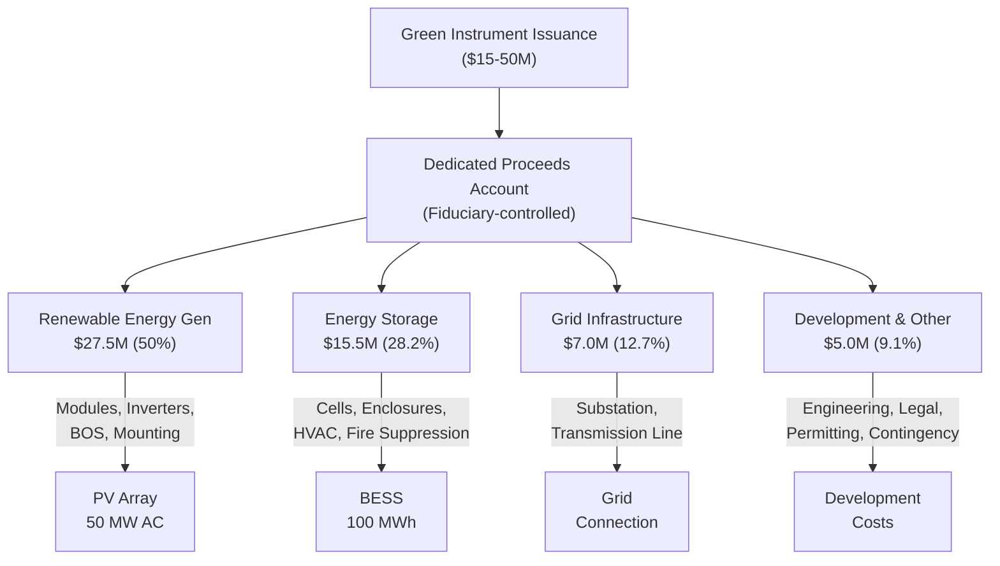

# TVRD Use-of-Proceeds Mapping

> **Classification: CONFIDENTIAL — Green Bond Framework**

## Purpose

Maps the SunFarm PV $55M CAPEX to the **Taxonomía Verde de la República Dominicana (TVRD)** eligible categories, establishing the "use of proceeds" framework required for any TVRD-labeled instrument (green bond, green fideicomiso, sustainability-linked loan).

---

## TVRD Eligible Categories

### Category Mapping

| TVRD Category | CAPEX Component | Amount | % of CAPEX | Eligible? |
|---|---|---|---|---|
| **Renewable Energy Generation** | PV modules (bifacial 760W × 78,500) | $18,000,000 | 32.7% | ✅ |
| **Renewable Energy Generation** | Inverters (central/string) | $5,000,000 | 9.1% | ✅ |
| **Renewable Energy Generation** | Structural / BOS / mounting | $4,500,000 | 8.2% | ✅ |
| **Energy Storage** | BESS system (25 MW / 100 MWh LFP) | $12,000,000 | 21.8% | ✅ |
| **Energy Storage** | BESS enclosures, HVAC, fire suppression | $3,500,000 | 6.4% | ✅ |
| **Clean Energy Infrastructure** | 138kV substation & transformers | $4,000,000 | 7.3% | ✅ |
| **Clean Energy Infrastructure** | 4.5km transmission line (double-circuit 138kV) | $3,000,000 | 5.5% | ✅ |
| **Sustainable Agriculture** | Agrivoltaic infrastructure | $500,000 | 0.9% | ✅ |
| **Project Development** | Engineering, permitting, advisory, legal | $2,500,000 | 4.5% | ⚠️ See note |
| **Contingency** | Construction contingency reserve | $2,000,000 | 3.6% | ⚠️ See note |
| **Total** | | **$55,000,000** | **100%** | |

### Notes on Partial Eligibility

- **Project development costs**: Eligible to the extent they are directly attributable to the green project. Legal, advisory, and permitting costs specifically for renewable energy are generally accepted.
- **Contingency reserve**: Eligible if ringfenced to the project and applied only to eligible cost categories.

### TVRD Eligibility Summary

| Classification | Amount | % of CAPEX |
|---|---|---|
| **Fully Eligible** | $50,500,000 | 91.8% |
| **Conditionally Eligible** | $4,500,000 | 8.2% |
| **Not Eligible** | $0 | 0% |

---

## TVRD Environmental Objectives

### Substantial Contribution Assessment

| TVRD Objective | SunFarm Contribution | Evidence |
|---|---|---|
| **Climate Change Mitigation** | ✅ Substantial | ~63,000 tCO₂/yr displaced; replaces fossil fuel generation |
| **Climate Change Adaptation** | ✅ Contributing | BESS provides grid resilience; agrivoltaics reduce agricultural climate risk |
| **Sustainable Water Use** | ⚠️ Neutral | Solar PV is low water use; no water contamination |
| **Circular Economy** | ⚠️ Neutral | Module recycling plan to be developed (20-year horizon) |
| **Pollution Prevention** | ✅ Contributing | No emissions, no effluent; LFP chemistry (no cobalt) |
| **Biodiversity** | ✅ Contributing | Agrivoltaic model maintains habitat; EIA approved |

### Do No Significant Harm (DNSH)

| Criterion | Assessment |
|---|---|
| Environmental Impact Assessment | ✅ License 0379-20 granted |
| No protected area encroachment | ✅ Confirmed in EIA |
| No significant water impact | ✅ Low water use technology |
| Waste management plan | ⬜ To be developed (module end-of-life) |
| Labor standards compliance | ✅ DR labor law compliant |
| No displacement or resettlement | ✅ Titled private land, no communities displaced |

---

## Proceeds Flow

---

## Reporting Commitments

### Annual Allocation Report

| Metric | Frequency | Verification |
|---|---|---|
| Proceeds allocated by category | Annual | External auditor |
| Unallocated proceeds balance | Annual | Trustee/fiduciary statement |
| Reallocation events | As needed | Disclosed in annual report |

### Annual Impact Report

| KPI | Unit | Baseline (Year 1) |
|---|---|---|
| Renewable electricity generated | MWh | 105,120 |
| CO₂ emissions avoided | tCO₂ | ~63,000 |
| Capacity factor achieved | % | 24% (target) |
| BESS utilization rate | % | TBD |
| Local jobs (construction) | FTE | TBD |
| Local jobs (operations) | FTE | TBD |
| Agricultural output | tonnes | TBD |
| Community benefit spending | USD | TBD |

---

*This mapping document supports TVRD-labeled issuance and should be provided to SPO providers, SIMV, and investors as part of the green framework documentation.*
