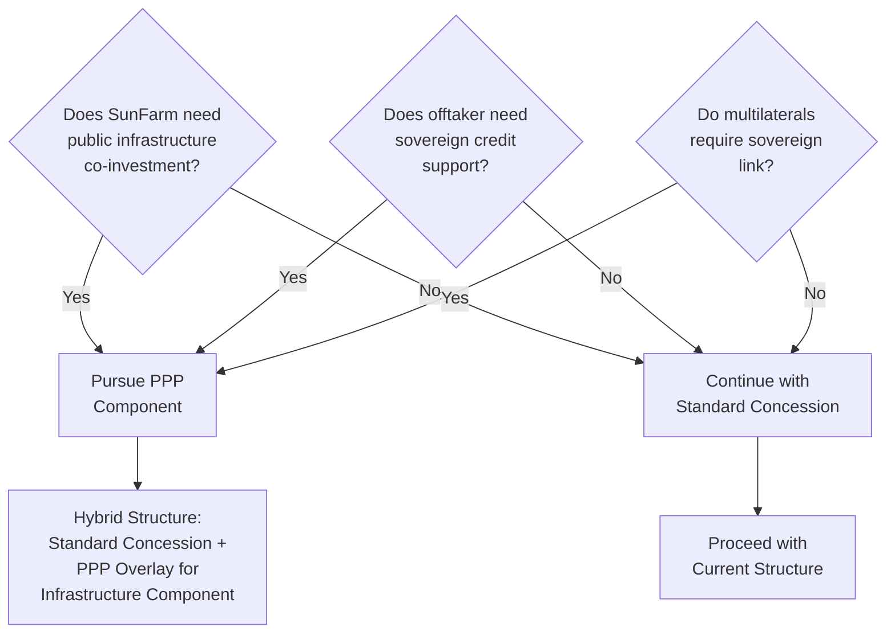

# PPP Law 47-20 — Pathway Assessment

> **Classification: CONFIDENTIAL — Structuring & Sovereign Engagement**

## Overview

Dominican Republic **Law 47-20** establishes the institutional framework for **Public-Private Partnerships (PPP)**. While SunFarm currently proceeds under a standard concession (CNE-CP-0012-2020 / CNE-CD-003-2023), a PPP pathway may unlock sovereign-grade de-risking, infrastructure co-investment, and multilateral comfort.

---

## Legal Framework

### Law 47-20 — Key Provisions

| Attribute | Detail |
|---|---|
| **Full Name** | Ley No. 47-20 sobre Alianzas Público-Privadas |
| **Effective** | 2020 |
| **Institutional Authority** | DGAPP (Dirección General de Alianzas Público-Privadas) |
| **Scope** | Infrastructure, energy, transport, water, health, education |
| **Eligible Structures** | Concessions, BOT, BTO, DBFOM, management contracts, mixed companies |

### Authoritative Sources

| Source | URL |
|---|---|
| **Law 47-20 English Text** | [DGAPP Official PDF](https://dgapp.gob.do/wp-content/uploads/2021/03/LAW-NO-47-20-EN.pdf) |
| **World Bank PPP Library** | [PPP Resource Center — Dominican Republic](https://ppp.worldbank.org/library/ppp-laws-concession-laws-dominican-republic) |

---

## When PPP Makes Sense for SunFarm

### Use Cases

| Scenario | PPP Component | Benefit |
|---|---|---|
| **Grid infrastructure upgrades** | Transmission corridor upgrade (138kV, 4.5km) wrapped as PPP co-investment | Reduces SunFarm CAPEX; ETED co-finances |
| **State-linked offtake support** | Government guarantee or CDEEE backstop on PPA payments | Reduces counterparty credit risk; enhances debt capacity |
| **Land access / right of way** | Government facilitates right-of-way for transmission line | Reduces permitting timeline and cost |
| **BESS as grid services asset** | BESS positioned as grid stability infrastructure under PPP framework | Unlocks public co-financing for storage; aligns with Decreto 517-25 mandate |
| **Sovereign comfort for multilaterals** | PPP structure triggers DFI appetite (IFC InfraVentures, IDB Invest) | Lower cost of capital; MIGA eligibility strengthened |

### Decision Framework

---

## PPP Process Under Law 47-20

| Phase | Duration | Activities |
|---|---|---|
| **1. Identification** | 2–4 months | Project assessment, DGAPP consultation, PPP eligibility screening |
| **2. Structuring** | 4–6 months | Financial modeling, risk allocation, VFM (value for money) analysis |
| **3. Transaction** | 6–12 months | Tender/negotiation, evaluation, award |
| **4. Contracting** | 3–6 months | Contract negotiation, financial close |
| **Total** | **15–28 months** | Significantly longer than standard concession pathway |

### Reality Check

| Factor | Assessment |
|---|---|
| **Timeline** | PPP is **slower** — adds 12–18 months vs. standard pathway |
| **Complexity** | Requires DGAPP engagement, additional legal workstreams |
| **Benefits** | Sovereign comfort, infrastructure co-investment, multilateral de-risking |
| **Recommendation** | **Pursue PPP only for specific components** (transmission, offtake guarantee, BESS co-investment) — not entire project |

---

## Hybrid Approach: Concession + PPP Component

### Recommended Structure

| Component | Pathway | Rationale |
|---|---|---|
| **PV Generation** | Standard CNE Concession (existing) | Already granted; no need to re-route |
| **BESS** | Potentially PPP co-investment | Aligns with Decreto 517-25 grid stability mandate |
| **Transmission** | Potentially PPP infrastructure | Government interest in grid strengthening |
| **PPA** | Standard bilateral | Unless sovereign guarantee sought |

### Benefits of Hybrid

1. **Keeps existing concession timeline intact** (no re-application needed)
2. **Unlocks selective public co-investment** for infrastructure components
3. **Triggers multilateral appetite** (IFC, IDB see sovereign engagement as positive signal)
4. **DGAPP engagement** creates additional institutional stakeholder (sovereign "champion")

---

## DGAPP Engagement

| Entity | Contact Point | Purpose |
|---|---|---|
| **DGAPP** (Dirección General de Alianzas Público-Privadas) | [dgapp.gob.do](https://dgapp.gob.do) | PPP framework authority; project assessment and structuring |
| **Ministry of Energy & Mines** | Via CNE coordination | Energy sector PPP alignment |
| **Ministry of Finance** | Fiscal commitment approval | Required for sovereign financial commitments |

---

## Recommendations

1. **Initial DGAPP consultation** — explore appetite for BESS and/or transmission PPP component (no commitment)
2. **Prepare VFM analysis** — demonstrate value-for-money of public co-investment
3. **Position BESS as grid infrastructure** — aligns with sovereign policy goals (Decreto 517-25)
4. **Maintain standard concession as primary pathway** — PPP is additive, not replacement
5. **Use PPP engagement as signal to multilaterals** — "sovereign engagement" triggers DFI comfort

---

*PPP pathway is a strategic option, not a requirement. This assessment should be revisited during DFI engagement and PPA negotiation phases.*
