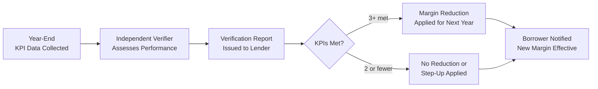

# Sustainability-Linked Loan — Margin Ratchet Model

> **Classification: CONFIDENTIAL — Loan Structuring**

## Overview

A Sustainability-Linked Loan (SLL) ties the loan margin to measurable KPI performance. If SunFarm meets sustainability targets, the margin decreases. If targets are missed, the margin increases.

This document defines the **margin ratchet mechanics** — used alongside the KPI Framework (`kpi-framework.md`).

---

## Margin Ratchet Structure

### Base Margin

| Parameter | Value |
|---|---|
| **Base Margin** | SOFR + 325 bps (3.25%) |
| **Maximum Reduction** | -75 bps (to SOFR + 250 bps) |
| **Maximum Step-Up** | +25 bps (to SOFR + 350 bps) |
| **Ratchet Frequency** | Annual (beginning Year 2) |
| **Verification** | Independent verifier's annual report |

### Margin Adjustment by KPI Performance

| KPIs Met (of 5) | Margin Adjustment | Effective Margin |
|---|---|---|
| **5/5 (all stretched)** | -75 bps | SOFR + 250 bps |
| **5/5 (all threshold)** | -50 bps | SOFR + 275 bps |
| **4/5** | -35 bps | SOFR + 290 bps |
| **3/5** | -15 bps | SOFR + 310 bps |
| **2/5** | 0 bps | SOFR + 325 bps (base) |
| **1/5** | +10 bps | SOFR + 335 bps |
| **0/5** | +25 bps | SOFR + 350 bps |

---

## KPI Summary (Cross-Reference)

| # | KPI | Threshold Target | Stretch Target | Weight |
|---|---|---|---|---|
| 1 | CO₂ Emissions Avoided | ≥ 55,000 tCO₂/yr | ≥ 63,000 tCO₂/yr | 30% |
| 2 | BESS Utilization Rate | ≥ 85% | ≥ 92% | 20% |
| 3 | Curtailment Rate | ≤ 3.0% | ≤ 1.5% | 15% |
| 4 | Local Employment Ratio | ≥ 70% local | ≥ 85% local | 20% |
| 5 | Water Management | ≤ 0.5 L/MWh | ≤ 0.3 L/MWh | 15% |

**Full detail:** See `capital/sustainability-linked-loan/kpi-framework.md`

---

## Financial Impact Modeling

### Assuming $25M SLL at Base Margin

| Scenario | KPIs Met | Annual Margin | Annual Interest | vs. Base |
|---|---|---|---|---|
| **All Stretch** | 5/5 stretch | SOFR + 250 | $1,375,000 | -$187,500/yr |
| **All Threshold** | 5/5 threshold | SOFR + 275 | $1,437,500 | -$125,000/yr |
| **Most Met** | 4/5 | SOFR + 290 | $1,475,000 | -$87,500/yr |
| **Baseline** | 2/5 | SOFR + 325 | $1,562,500 | — |
| **Underperformance** | 0/5 | SOFR + 350 | $1,625,000 | +$62,500/yr |

> **25-Year cumulative impact of full stretch:** ~$4.7M in interest savings (undiscounted)

### WACC Impact

| Scenario | SLL Margin | Blended WACC Impact |
|---|---|---|
| Full stretch (-75 bps) | 2.50% over SOFR | -15 to -25 bps on project WACC |
| Full step-up (+25 bps) | 3.50% over SOFR | +5 to +10 bps on project WACC |

---

## Ratchet Mechanics

### Annual Process

### Step-Up Mechanism

If KPIs are **missed for 2 consecutive years**:

| Consecutive Misses | Action |
|---|---|
| Year 1 miss | Standard step-up applied (+10 to +25 bps) |
| Year 2 consecutive miss | Step-up doubles; sustainability report required to lender |
| Year 3 consecutive miss | Lender may request remediation plan; potential reclassification |

### Charitable Donation Alternative

Per SLL Principles (LMA/APLMA/LSTA): if step-up margin is not applied, the equivalent amount may be directed to a qualified environmental or social charitable purpose. This is an **optional** mechanism — most institutional lenders prefer the direct margin step-up.

---

## Target Lenders for SLL

| Institution | Type | SLL Experience | DR Presence |
|---|---|---|---|
| **Banco Popular Dominicano** | Local commercial | Growing ESG focus | ✅ Major |
| **BanReservas** | State-owned | Government sustainability mandate | ✅ Major |
| **Scotiabank DR** | International commercial | Active SLL originator globally | ✅ Present |
| **Citibank DR** | International commercial | Global SLL leader | ✅ Present |
| **Santander** | International commercial | Active SLL in LatAm | ✅ Present |
| **BICE** | DFI | Regional development mandate | Via partnership |

---

## Alignment with SLL Principles

| LMA/APLMA/LSTA Component | SunFarm Status |
|---|---|
| **Selection of KPIs** | ✅ 5 KPIs defined, measurable, relevant |
| **Calibration of SPTs** | ✅ Threshold + stretch targets calibrated |
| **Loan Characteristics** | ✅ Margin ratchet with bi-directional adjustment |
| **Reporting** | ⬜ Annual reporting template needed |
| **Verification** | ⬜ Independent verifier to be engaged |

---

*This margin ratchet model should be included in lender presentations and term sheet negotiations. The dual TVRD + SLL Principles alignment positions SunFarm for optimal DR + international pricing.*
