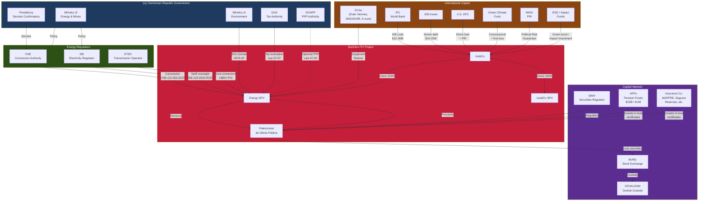

# DR Capital Plumbing Map

> Mermaid diagram showing all DR regulatory entities, capital channels, and their interconnections for SunFarm PV.

---

*This diagram maps the complete regulatory and capital plumbing for SunFarm PV in the Dominican Republic. All entities shown are real institutions with defined roles in the project lifecycle.*
