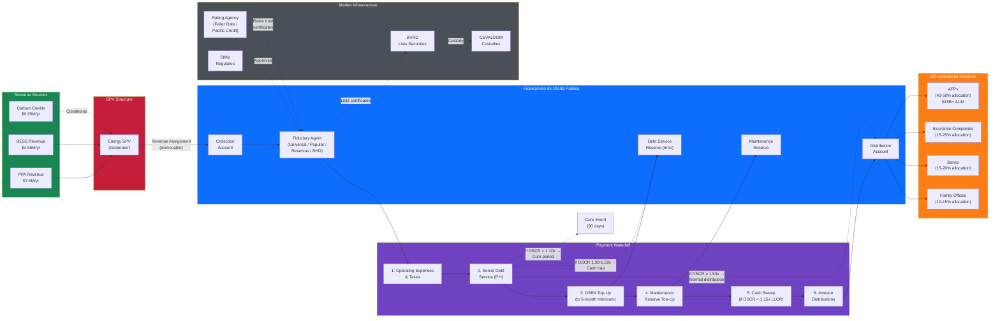

# Fideicomiso Workflow

> Mermaid diagram showing the cashflow routing from SunFarm PV through the fideicomiso de oferta pública to DR institutional investors.

---

## Trust Certificate Structure

| Attribute | Detail |
|---|---|
| **Instrument** | Cuotas de Participación (Participation Certificates) |
| **Type** | Senior Fixed-Income — Green Labeled (TVRD) |
| **Currency** | USD |
| **Target Size** | $15–30M |
| **Tenor** | 10–15 years |
| **Coupon** | 7.5–9.5% fixed (USD) |
| **Rating** | Target: investment-grade (DR scale) |
| **Listing** | BVRD |
| **Custody** | CEVALDOM |
| **Tax** | Exempt under Ley 57-07 (subject to counsel confirmation) |

---

*This diagram should be used in investor presentations and fideicomiso structuring discussions with fiduciary providers.*
