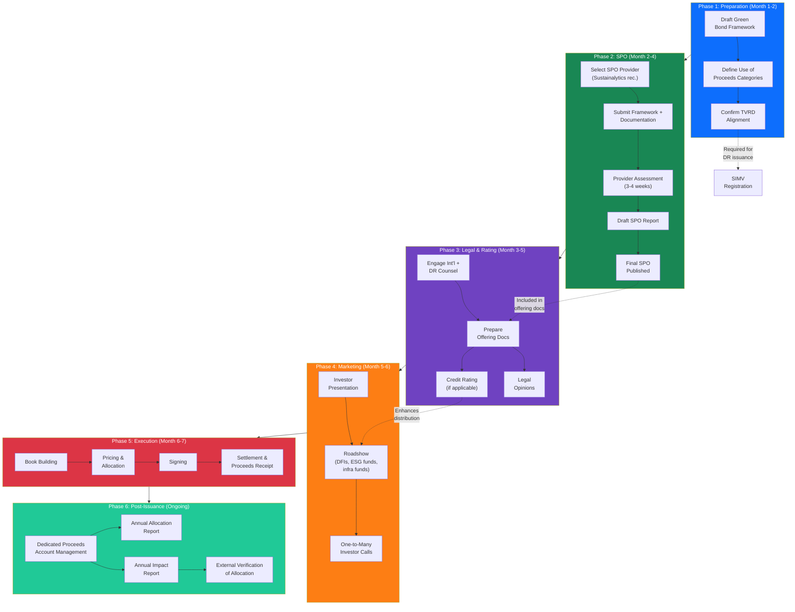

# Green Bond Issuance Workflow

> Mermaid diagram showing the full green bond issuance workflow from framework to reporting, integrating ICMA GBP, TVRD, and SPO processes.

---

## Key Compliance Gates

| Gate | Standard | Pass Criteria |
|---|---|---|
| **ICMA GBP Pillar 1** | Use of Proceeds | ≥90% CAPEX mapped to eligible categories ✅ |
| **ICMA GBP Pillar 2** | Project Evaluation & Selection | TVRD alignment + EIA + exclusion criteria ✅ |
| **ICMA GBP Pillar 3** | Management of Proceeds | Dedicated account + fiduciary oversight ⬜ |
| **ICMA GBP Pillar 4** | Reporting | Annual allocation + impact reports ⬜ |
| **TVRD** | DR Green Taxonomy | Solar + BESS eligible categories ✅ |
| **SPO** | Second Party Opinion | Independent verification ⬜ |

---

*This workflow should be used as the master schedule for green bond issuance. All phases can be parallelized where noted by dotted lines.*
