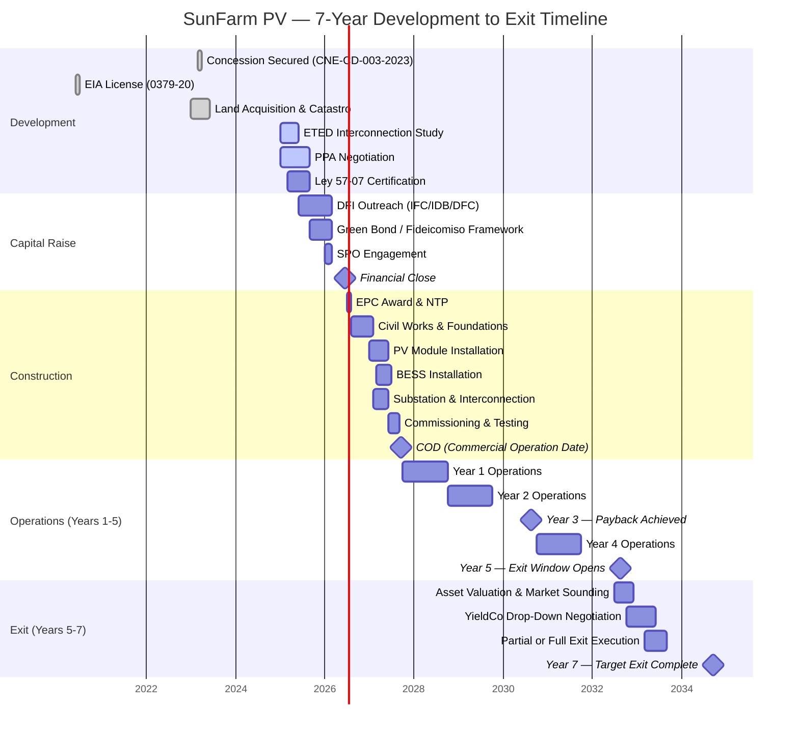
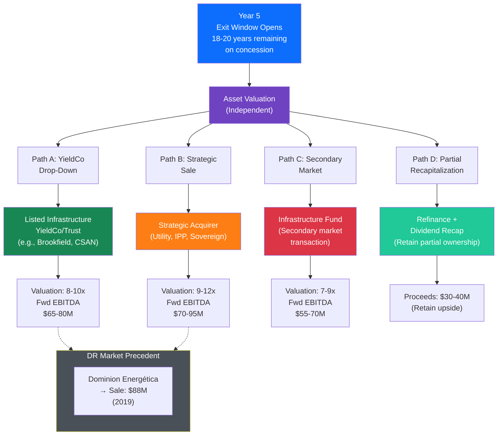

# 7-Year Timeline & Exit Flow

> Mermaid diagram showing the SunFarm PV project lifecycle from development through Year 7 exit, including capital raises, milestones, and exit pathways.

---

## Exit Pathway Options

---

## Key Milestones Summary

| Year | Milestone | Significance |
|---|---|---|
| **2023** | Definitive concession granted | 25-year development right secured |
| **2025-26** | Financial close | Capital stack assembled; construction begins |
| **2027** | COD | Revenue generation starts |
| **2030** | Payback achieved (~Year 3) | Equity fully returned |
| **2032** | Exit window opens (Year 5) | Optimal disposition timing |
| **2034** | Target exit (Year 7) | Maximum sponsor value realization |

---

## Financial Trajectory

| Metric | Year 1 | Year 3 | Year 5 | Year 7 |
|---|---|---|---|---|
| **Annual Revenue** | $12.1M | $12.4M | $12.7M | $13.0M |
| **Cumulative FCF** | $8.5M | $28.2M | $48.8M | $69.5M |
| **DSCR** | 3.90x | 3.72x | 3.55x | 3.38x |
| **Equity Multiple** | 0.39x | 1.28x | 2.22x | 3.16x |
| **Remaining Concession** | 24 years | 22 years | 20 years | 18 years |
| **Asset Valuation** | ~$80M | ~$78M | ~$75M | ~$72M |

---

*This timeline assumes financial close in mid-2026. All dates are indicative and subject to PPA execution, regulatory approvals, and market conditions.*
