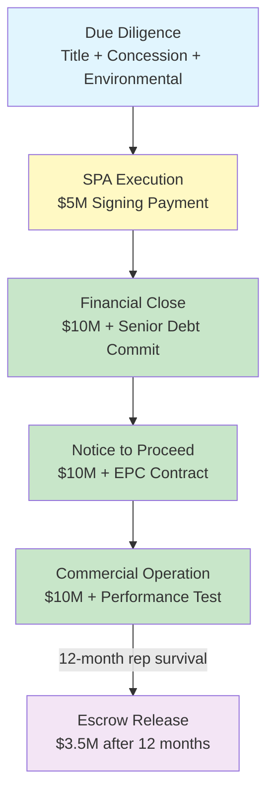

# Asset Purchase Framework — $35M Full-Asset Acquisition

**SunFarm PV Project — Baní, Dominican Republic**
**Classification: CONFIDENTIAL — Qualified Investors & Diligence Counsel Only**

---

## 1. Transaction Summary

| Parameter | Value |
|---|---|
| **Transaction Type** | Full-Asset Acquisition (Land + Concession + SPV + Permits) |
| **Purchase Price** | USD $35,000,000 |
| **Appraised Land Value** | USD $47,900,000 (27% discount to appraisal) |
| **Buyer** | SunFarm Holdings LLC (Delaware) |
| **Seller** | Current Asset Holders (William Meredith Driver / Jorge Morales Paulino) |
| **Target Entity** | Sunfarming Dom Rep Invest, S.R.L. (RNC 1-31-94471-1) |
| **Governing Law** | Dominican Republic (DR Civil Code, Ley 479-08, Ley 125-01) |
| **Arbitration** | ICC International Court of Arbitration, Santo Domingo seat |

---

## 2. Staged Payment Structure

Total acquisition price of $35,000,000 structured in four milestone-linked tranches with 10% escrow holdback:

```
┌─────────────────────────────────────────────────────────────────────┐
│  PAYMENT STAGING — $35M FULL-ASSET ACQUISITION                     │
├──────────────┬────────────┬─────────────────────────────────────────┤
│  Milestone   │   Amount   │  Condition Precedent                   │
├──────────────┼────────────┼─────────────────────────────────────────┤
│  Signing     │  $5,000,000│  Execution of definitive SPA           │
│  FC          │ $10,000,000│  Financial close + senior debt commit   │
│  NTP         │ $10,000,000│  Notice to proceed from EPC contractor  │
│  COD         │ $10,000,000│  Commercial operation date achieved     │
├──────────────┼────────────┼─────────────────────────────────────────┤
│  TOTAL       │ $35,000,000│                                        │
│  Escrow      │  $3,500,000│  10% holdback released 12 months post- │
│  Holdback    │            │  COD subject to rep & warranty survival │
└──────────────┴────────────┴─────────────────────────────────────────┘
```

### 2.1 Payment Milestones

| Phase | Amount | Trigger | Escrow Impact |
|---|---|---|---|
| **Signing** | $5,000,000 | Execution of Share Purchase Agreement | $500,000 to escrow |
| **Financial Close** | $10,000,000 | Senior lender commitment letter received | $1,000,000 to escrow |
| **Notice to Proceed** | $10,000,000 | EPC NTP issued, all permits confirmed | $1,000,000 to escrow |
| **Commercial Operation** | $10,000,000 | Grid sync + 30-day performance test | $1,000,000 to escrow |

### 2.2 Escrow Mechanics

- **Escrow Agent**: Major DR commercial bank (Banco Popular or Banreservas)
- **Holdback**: 10% of each tranche ($3,500,000 total)
- **Release**: 12 months after COD, subject to:
  - No outstanding indemnification claims
  - All reps & warranties survive 24-month period
  - No material adverse change in concession status
  - Environmental compliance confirmed
- **Interest**: Escrow earns interest at 90-day T-bill rate; interest accrues to Seller

---

## 3. Assets Included

### 3.1 Core Assets

| Asset | Description | Valuation Component |
|---|---|---|
| **Land** | 440.68 ha, Parcela 59, DC-08, Title Certificate 0500009639 | $24,000,000 (appraisal-based) |
| **Concession** | CNE-CP-0012-2020 — 25-year definitive concession | $6,000,000 (regulatory value) |
| **SPV Equity** | 100% shares of Sunfarming Dom Rep Invest, S.R.L. | $2,000,000 (entity value) |
| **Permits** | Environmental license 0379-20, ETED no-objection | $1,500,000 (time + cost value) |
| **Development Rights** | Engineering studies, interconnection approvals, PPA framework | $1,500,000 (development premium) |

### 3.2 Excluded Assets

- Personal property of current owners not related to the project
- Any assets outside Parcela 59 boundaries
- Third-party intellectual property or software licenses
- Seller's corporate entities not part of the SPV chain

---

## 4. Representations & Warranties

### 4.1 Seller Representations

1. **Title**: Seller holds clear, unencumbered freehold title to Parcela 59
2. **No Superposition**: Certified by Tribunal Superior de Tierras (Oct 21, 2024)
3. **Concession Status**: CNE-CP-0012-2020 is in good standing and transferable
4. **Environmental**: Environmental license 0379-20 is current and no pending violations
5. **Tax Compliance**: All Dominican tax obligations current (DGII)
6. **No Litigation**: No pending or threatened litigation affecting the assets
7. **Accurate Financials**: All financial records provided are complete and accurate
8. **No Encumbrances**: No liens, mortgages, or charges on the property (cargas y gravámenes)
9. **Employee Matters**: No undisclosed labor obligations or claims
10. **Regulatory Compliance**: Full compliance with Ley 125-01, Ley 57-07, and all energy regulations

### 4.2 Buyer Representations

1. **Authority**: Buyer has full corporate authority to execute the acquisition
2. **Funding**: Buyer has committed capital to fund all staged payments
3. **No Conflicts**: Transaction does not conflict with Buyer's existing obligations
4. **Regulatory Capability**: Buyer can hold a DR energy concession under applicable law

### 4.3 Survival Period

- **Fundamental Reps** (title, authority, no encumbrances): 36 months
- **General Reps**: 24 months
- **Tax & Environmental Reps**: 60 months (statute of limitations)
- **Indemnification Cap**: 20% of purchase price ($7,000,000)
- **De Minimis Threshold**: $50,000 per individual claim
- **Basket**: $250,000 aggregate before indemnification triggered

---

## 5. Conditions Precedent

### 5.1 To Signing

- [ ] Completion of buyer due diligence
- [ ] Board approvals from Buyer and Seller entities
- [ ] Title search and no-superposition confirmation refresh
- [ ] Environmental compliance verification
- [ ] Proof of available funds for signing tranche ($5M)

### 5.2 To Financial Close

- [ ] Senior lender commitment letter (minimum $33M facility)
- [ ] Insurance placement (construction all-risk + liability)
- [ ] EPC contractor selection and term sheet
- [ ] CNE confirmation of concession transferability
- [ ] DGII tax clearance certificate

### 5.3 To Notice to Proceed

- [ ] EPC contract executed
- [ ] All construction permits obtained
- [ ] ETED interconnection agreement signed
- [ ] Environmental management plan approved
- [ ] Construction insurance in force

### 5.4 To Commercial Operation

- [ ] Grid synchronization achieved
- [ ] 30-day performance ratio test passed (PR ≥ 80%)
- [ ] ETED acceptance of interconnection
- [ ] Final as-built survey completed
- [ ] O&M agreement executed

---

## 6. Risk Allocation

| Risk | Allocation | Mitigation |
|---|---|---|
| **Title Defect** | Seller | Escrow holdback + title insurance |
| **Concession Transfer Failure** | Shared | CNE pre-approval as CP |
| **Construction Delay** | Buyer (post-NTP) | EPC liquidated damages |
| **Regulatory Change** | Shared | Force majeure clause |
| **Environmental Liability** | Seller (pre-closing) | Environmental audit + indemnity |
| **Currency Risk** | Buyer | USD-denominated transaction |
| **Tax Assessment** | Seller (pre-closing periods) | Tax indemnity with 60-month survival |

---

## 7. Total Basis Analysis

| Component | Amount | Notes |
|---|---|---|
| **Acquisition Price** | $35,000,000 | Full-asset purchase |
| **CAPEX (Construction)** | $55,000,000 | EPC + BESS + transmission |
| **Total Project Basis** | $90,000,000 | Acquisition + construction |
| **Transaction Costs** | ~$2,000,000 | Legal, advisory, transfer taxes |
| **All-In Basis** | ~$92,000,000 | Total deployed capital |

### 7.1 IRR Sensitivity to Total Basis

| Total Basis | Levered IRR (Base) | Min DSCR | Equity Multiple | Status |
|---|---|---|---|---|
| $55M (CAPEX only) | 43.3% | 3.90x | 11.37x | ✅ Baseline |
| $75M ($20M + $55M) | ~28% | 3.20x | 6.5x | ✅ Acceptable |
| $90M ($35M + $55M) | ~18-22% | 2.50x | 4.0x | ⚠️ Floor target |
| $100M ($45M + $55M) | ~14% | 2.00x | 3.0x | ❌ Overpriced |

> **CRITICAL**: If $90M total basis drives IRR below 18%, the acquisition is overpriced. The acquisition-impact model (`models/acquisition-impact.js`) demonstrates this instantly across all D/E scenarios.

---

## 8. Governing Law & Dispute Resolution

- **Governing Law**: Laws of the Dominican Republic
- **Corporate Law**: Ley 479-08 (Commercial Societies)
- **Energy Law**: Ley General de Electricidad 125-01, Ley 57-07
- **Property Law**: DR Civil Code, Ley 108-05 (Land Registration)
- **Arbitration**: ICC International Court of Arbitration
- **Seat**: Santo Domingo, Dominican Republic
- **Language**: Spanish (English translations for reference only)
- **Arbitrators**: Three (one per party, one ICC-appointed)
- **Enforcement**: New York Convention (DR is signatory)

---

## 9. Mermaid — Acquisition Flow



---

*Document Version: 1.0 — Generated by SunFarm Platform*
*Date: 2025-07-08*
*Classification: CONFIDENTIAL*
