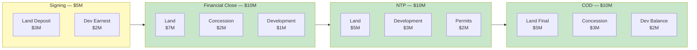

# Earn-Out Addendum — Milestone-Linked Value Allocation

**SunFarm PV Project — Baní, Dominican Republic**
**Addendum to Share Purchase Agreement**
**Classification: CONFIDENTIAL — Qualified Investors & Diligence Counsel Only**

---

## 1. Purpose

This Earn-Out Addendum separates the $35,000,000 acquisition price into distinct value components (Land Value, Development Premium, Concession Value) and establishes milestone-linked payment triggers that align Seller compensation with project risk reduction.

---

## 2. Value Decomposition

### 2.1 Asset-Level Value Allocation

| Component | Allocated Value | % of Total | Basis |
|---|---|---|---|
| **Land Value** | $20,000,000 | 57.1% | Parcela 59, 440.68 ha — discount to $47.9M appraisal |
| **Development Premium** | $8,000,000 | 22.9% | Engineering, studies, interconnection, PPA framework |
| **Concession Value** | $5,000,000 | 14.3% | CNE-CP-0012-2020, 25-year definitive |
| **Permits & Approvals** | $2,000,000 | 5.7% | Environmental license, ETED no-objection, regulatory approvals |
| **TOTAL** | **$35,000,000** | **100%** | |

### 2.2 Value Allocation Rationale

```
┌─────────────────────────────────────────────────────────────────┐
│  VALUE ALLOCATION — $35M ACQUISITION                            │
│                                                                  │
│  Appraised Land Value:               $47,900,000                │
│  Acquisition Land Component:         $20,000,000 (42% discount) │
│  Development Premium:                 $8,000,000                │
│  Concession + Permits:                $7,000,000                │
│  ─────────────────────────────────────                          │
│  Total Acquisition:                  $35,000,000                │
│                                                                  │
│  Discount to Appraisal:              $12,900,000 (27%)          │
│  Buyer's Risk-Adjusted Savings:       $12,900,000               │
│  Seller's Earned Premium:             $15,000,000               │
│  (Development + Concession + Permits)                           │
└─────────────────────────────────────────────────────────────────┘
```

---

## 3. Earn-Out Mechanics

### 3.1 Milestone Payment Matrix

The earn-out structure links each payment tranche to specific project milestones, ensuring Seller receives compensation proportional to risk reduction:

| Milestone | Payment | Released Components | Cumulative Paid | Risk Level |
|---|---|---|---|---|
| **Signing** | $5,000,000 | Land deposit + Development earnest | $5M | High |
| **Financial Close** | $10,000,000 | Land balance + Concession partial | $15M | Medium-High |
| **NTP** | $10,000,000 | Development earnout + Permits | $25M | Medium |
| **COD** | $10,000,000 | Concession balance + Final land | $35M | Low |

### 3.2 Earn-Out Component Breakdown per Tranche

#### Tranche 1 — Signing ($5,000,000)

| Component | Amount | Description |
|---|---|---|
| Land Deposit | $3,000,000 | Good-faith land acquisition deposit |
| Development Earnest | $2,000,000 | Access to engineering studies and data room |

#### Tranche 2 — Financial Close ($10,000,000)

| Component | Amount | Description |
|---|---|---|
| Land Payment | $7,000,000 | Second land installment upon debt commitment |
| Concession Value | $2,000,000 | Partial concession premium — confirmed transferable |
| Development Premium | $1,000,000 | Interconnection study and PPA framework value |

#### Tranche 3 — NTP ($10,000,000)

| Component | Amount | Description |
|---|---|---|
| Land Payment | $5,000,000 | Third land installment at construction start |
| Development Premium | $3,000,000 | EPC and construction permit package value |
| Permits | $2,000,000 | Environmental license and ETED approvals |

#### Tranche 4 — COD ($10,000,000)

| Component | Amount | Description |
|---|---|---|
| Land Final | $5,000,000 | Final land payment at commercial operation |
| Concession Balance | $3,000,000 | Full concession value recognized at COD |
| Development Balance | $2,000,000 | Final development premium upon proven operation |

---

## 4. Performance Adjustments

### 4.1 Upward Adjustments (Seller Bonus)

If the project achieves the following at COD, Seller receives an additional earn-out payment:

| Achievement | Bonus Amount | Condition |
|---|---|---|
| PPA signed ≥ $72/MWh | $500,000 | Signed PPA exceeds base case |
| COD within 24 months of NTP | $500,000 | Early completion |
| Performance Ratio ≥ 82% | $250,000 | Exceeds 80% PR threshold |
| Carbon credits registered | $250,000 | UNFCCC or Gold Standard registration |

**Maximum Upward Adjustment**: $1,500,000

### 4.2 Downward Adjustments (Purchase Price Reduction)

If the following conditions exist at COD, the final tranche is reduced:

| Deficiency | Reduction | Condition |
|---|---|---|
| Title defect discovered | Up to $5,000,000 | Proportional to affected area |
| Concession conditions imposed | Up to $2,000,000 | Additional compliance costs |
| Environmental remediation required | Up to $2,000,000 | Cost of remediation |
| Tax assessment on pre-closing periods | At cost | Dollar-for-dollar reduction |

**Maximum Downward Adjustment**: $7,000,000 (20% of purchase price)

---

## 5. Escrow Holdback and Earn-Out

### 5.1 Relationship to Escrow

The 10% escrow holdback ($3,500,000) serves as security for:

1. **Rep & Warranty Claims**: Indemnification for breaches discovered post-closing
2. **Earn-Out Adjustments**: Downward adjustment amounts are first applied against escrow
3. **Environmental**: Any remediation costs arising from pre-closing conditions
4. **Tax**: Pre-closing tax assessments by DGII

### 5.2 Escrow Release Schedule

| Trigger | Amount Released | Timing |
|---|---|---|
| COD + 6 months (no claims) | $1,750,000 (50%) | 6 months post-COD |
| COD + 12 months (no claims) | $1,750,000 (50%) | 12 months post-COD |
| Disputed amounts | Held pending resolution | Until arbitration/settlement |

---

## 6. Accounting & Tax Treatment

### 6.1 Dominican Republic Tax Implications

| Tax | Rate | Application |
|---|---|---|
| **Transfer Tax** (Registro de Títulos) | 3% of assessed value | On land transfer registration |
| **Capital Gains** (Seller) | 27% of gain | DR-sourced income |
| **ITBIS** (Value Added Tax) | Not applicable | Real property transfer exempt |
| **Withholding** | 27% on payments to non-residents | If Seller is non-resident |
| **Municipal Tax** | Varies by municipality | Baní municipal requirements |

### 6.2 Buyer's Tax Basis

| Component | Amount | Depreciation / Amortization |
|---|---|---|
| Land | $20,000,000 | Not depreciable |
| Development Costs | $8,000,000 | Amortized over concession term (25 years) |
| Concession | $5,000,000 | Amortized over concession term (25 years) |
| Permits | $2,000,000 | Amortized over permit validity period |
| **Total Acquisition Basis** | **$35,000,000** | |

---

## 7. Dispute Resolution for Earn-Out Matters

Earn-out disputes shall be resolved according to the following escalation:

1. **Negotiation**: 30-day good-faith negotiation between principals
2. **Independent Expert**: Appointment of independent valuation expert (Big Four firm)
3. **Arbitration**: ICC arbitration per the SPA terms

**Expert Determination**: For disputes solely related to milestone achievement or performance metrics, an independent technical expert appointed by mutual agreement shall make a binding determination within 60 days.

---

## 8. Mermaid — Earn-Out Value Flow



---

## 9. Adenda de Earn-Out / Earn-Out Addendum (Resumen en Español)

### Asignación de Valor

| Componente | Valor Asignado | Porcentaje |
|---|---|---|
| **Valor del Terreno** | $20,000,000 | 57.1% |
| **Prima de Desarrollo** | $8,000,000 | 22.9% |
| **Valor de Concesión** | $5,000,000 | 14.3% |
| **Permisos y Aprobaciones** | $2,000,000 | 5.7% |

### Pagos por Hito

| Hito | Monto | Componentes |
|---|---|---|
| Firma | $5,000,000 | Depósito terreno + Arras desarrollo |
| Cierre Financiero | $10,000,000 | Terreno + Concesión parcial + Desarrollo |
| Aviso de Proceder | $10,000,000 | Terreno + Desarrollo + Permisos |
| Operación Comercial | $10,000,000 | Terreno final + Concesión + Desarrollo |

---

*Document Version: 1.0 — Generated by SunFarm Platform*
*Date: 2025-07-08*
*Classification: CONFIDENTIAL*
