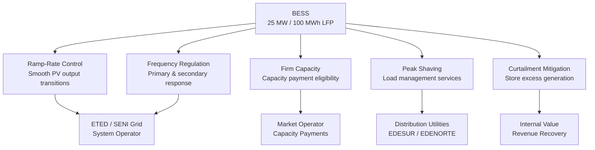

# BESS Compliance & Grid Services Memo

> **Classification: CONFIDENTIAL — Technical & Regulatory Diligence**

## Purpose

This memo documents the Battery Energy Storage System (BESS) compliance requirements for the SunFarm PV project in the Dominican Republic, including the evolving **mandatory BESS rules** for renewable energy projects, grid services revenue modeling, and interconnection technical requirements.

---

## Regulatory Context: Mandatory BESS for Renewables

### Overview

The Dominican Republic has implemented and is actively evolving **mandatory BESS requirements** for new renewable energy projects. This regulatory tightening reflects the grid operator's need to manage intermittency as renewable penetration increases.

**Source:** [Strategic Energy Europe — Dominican Republic Sets Mandatory BESS Rules for Renewables](https://strategicenergy.eu/dominican-republic-sets-mandatory-bess-rules-for-renewables-what-projects-must-consider/)

### Key Regulatory Points

| Parameter | Detail |
|---|---|
| **Mandate** | Battery storage required for new renewable generation projects |
| **Regulatory Framework** | Decreto 517-25 (2025) |
| **Applicability** | New and expanding renewable energy projects connected to SENI |
| **Phase-in** | Active — requirements evolving with grid needs |
| **Technical Standards** | Ramp-rate control, frequency response, firm capacity contribution |

### SunFarm Compliance Position

| Requirement | SunFarm Configuration | Status |
|---|---|---|
| **BESS Installed** | 25 MW / 100 MWh (4-hour LFP) | ✅ Compliant — exceeds minimum |
| **Power Rating** | 25 MW (50% of PV capacity) | ✅ Above typical 20-30% threshold |
| **Duration** | 4 hours | ✅ Meets expected minimum |
| **Chemistry** | LFP (Lithium Iron Phosphate) | ✅ No thermal runaway risk, long cycle life |
| **Grid-Forming Capability** | To be specified in EPC | ⬜ Confirm requirement |
| **Ramp-Rate Control** | BESS enables smooth output | ✅ Inherent capability |

---

## Grid Services Revenue & Compliance

### What Functionality Is Required

### Who Pays for Ancillary Services

| Service | Payer | Mechanism | Status |
|---|---|---|---|
| **Ramp-rate control** | Internal / compliance cost | Required for interconnection | Mandatory |
| **Frequency regulation** | Grid operator / market mechanism | Ancillary services contract | Market developing |
| **Capacity payments** | System operator / distribution companies | Firm capacity credit | Available |
| **Peak shaving** | Distribution utilities (EDESUR, EDENORTE) | Bilateral or market contract | Negotiable |
| **Curtailment mitigation** | Internal value recovery | Stores otherwise-curtailed energy | Internal benefit |

### Revenue Modeling (Conservative Approach)

| Stream | Year 1 Revenue | Assumption | Conservatism Level |
|---|---|---|---|
| **Energy Arbitrage** | $1.82M | Price differential × cycling | Conservative — assumes moderate spread |
| **Frequency Regulation** | $1.10M | Ancillary services market rate | Conservative — DR market developing |
| **Capacity Payments** | $0.91M | $36,400/MW/yr × 25 MW | Conservative — below international benchmarks |
| **Peak Shaving** | $0.59M | Demand charge reduction contracts | Conservative — bilateral negotiation dependent |
| **Curtailment Mitigation** | $0.14M | Recovered energy at PPA rate | Conservative — function of curtailment events |
| **Total** | **$4.56M** | | **Conservative across all streams** |

### Revenue Conservatism Notes

| Parameter | Model Value | International Benchmark | Gap |
|---|---|---|---|
| Capacity payment ($/MW/yr) | $36,400 | $50,000–$80,000 | 27–55% below benchmark |
| Frequency reg rate | $44/MW/hr | $60–$100/MW/hr | 26–56% below benchmark |
| Arbitrage spread | $40/MWh implied | $50–$80/MWh in mature markets | Conservative |

> **Committee takeaway:** BESS revenue is modeled conservatively. Upside exists as DR ancillary services market matures.

---

## Interconnection Requirements

### Technical Parameters

| Parameter | Requirement | SunFarm Specification |
|---|---|---|
| **POI** | 138 kV bus — Peravia Solar I & II | Confirmed |
| **Alternative POI** | Calabaza I | Identified |
| **Transmission** | 4.5 km double-circuit 138kV | Designed |
| **ETED No-Objection** | Required | ✅ Approved (Feb 2024, revalidated May 2025) |
| **Metering** | Revenue-grade bi-directional | To be installed |
| **Protection** | Distance, overcurrent, under/over frequency | Per ETED standards |
| **SCADA Integration** | Real-time telemetry to grid operator | Required |

### BESS-Specific Interconnection

| Requirement | Status | Notes |
|---|---|---|
| Combined PV+BESS interconnection | ✅ Designed as integrated system | Single POI for both |
| BESS operating mode flexibility | ✅ | Charge from PV, charge from grid, discharge to grid |
| Black start capability | ⬜ To be confirmed | May be required for grid-forming |
| Reactive power support | ✅ | Inverter-based with BESS augmentation |

---

## Compliance Risk Assessment

| Risk | Probability | Impact | Mitigation |
|---|---|---|---|
| BESS mandate increases (larger storage required) | Medium | Medium | Current 50% ratio provides buffer; augmentation pathway exists |
| Grid-forming requirements added | Medium | Low-Medium | BESS inverters can be specified for grid-forming |
| Ancillary services market rules change | Medium | Low | Conservative revenue assumptions provide buffer |
| ETED interconnection requirements tighten | Low | Medium | No-objection already secured and revalidated |
| BESS degradation below compliance threshold | Low | Medium | LFP chemistry, 2%/yr assumption, Year 15 augmentation budgeted |

---

## Recommendations

1. **Monitor Decreto 517-25 implementation** — requirements may evolve
2. **Specify grid-forming inverters** in BESS EPC scope (future-proofing)
3. **Engage ETED early on SCADA integration** requirements
4. **Negotiate ancillary services contract** during PPA negotiation (bundle)
5. **Document BESS compliance in data room** as dedicated exhibit
6. **Budget for potential augmentation** — $7.5M at Year 15 already included in model

---

*This memo addresses both regulatory compliance and revenue modeling for the BESS component. Revenue projections are intentionally conservative to support credit committee confidence.*
