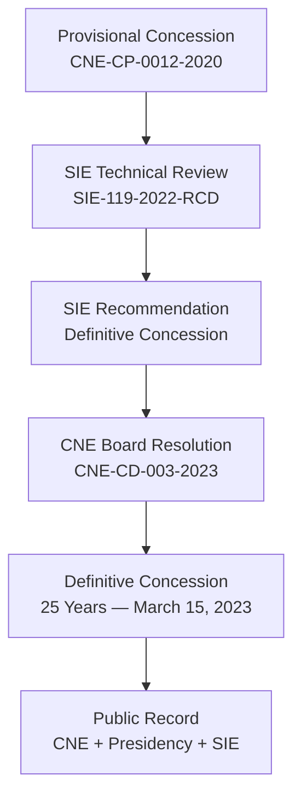

# CNE Concession Record

> **Classification: CONFIDENTIAL — Diligence & Credit Committee Use Only**

## Concession Summary

| Field | Detail |
|---|---|
| **Project** | Complejo Agroenergético e Innovador para la Generación de Energía Fotovoltaica y Producción Agrícola — Sunfarming Food & Energy |
| **Applicant** | Sunfarming Dom Rep Invest, S.R.L. |
| **RNC** | 1-31-94471-1 |
| **Capacity** | 50 MW AC / 59.696 MWp DC |
| **Location** | Baní, Peravia Province, Dominican Republic |
| **Resolution** | CNE-CD-003-2023 |
| **Type** | Definitive Concession |
| **Duration** | 25 years |
| **Date Issued** | March 15, 2023 |
| **Prior Provisional** | CNE-CP-0012-2020 |

---

## Public Record Sources

### 1. CNE Project Listing

The Comisión Nacional de Energía maintains a public project page confirming:

- Entity: Sunfarming Dom Rep Invest, S.R.L.
- Project: 50 MW / 59.696 MWp photovoltaic + agricultural complex
- Location: Baní, Peravia
- Resolution: CNE-CD-003-2023
- Duration: 25 years

**Source:** [CNE — Complejo Agroenergético Sunfarming Food & Energy 50 MW](https://cne.gob.do/complejo-agroenergetico-e-innovador-para-la-generacion-de-energia-fotovoltaica-y-produccion-agricola-sunfarming-food-energy-50-mw/)

### 2. Presidency Confirmation

The Dominican Republic Presidency publicly reported granting the definitive concession for "Sunfarming Food & Energy 50 MW" under the renewable energy and energy transition portfolio.

**Source:** [Presidencia de la República Dominicana — Energías Renovables](https://presidencia.gob.do/taxonomy/term/178?page=2)

### 3. SIE Regulatory Recommendation

The Superintendencia de Electricidad (SIE) issued document **SIE-119-2022-RCD** containing the formal recommendation for definitive concession for this project.

**Source:** [SIE — SIE-119-2022-RCD Recommendation](https://sie.gob.do/document/https-sie-gob-do-wp-content-uploads-2022-11-sie-119-2022-rcd-rec-cne-cd-sunfarmimg-food-energy-de-50mw-2-pdf/)

---

## Concession Pathway

---

## Key Regulatory Entities

| Entity | Role | Status |
|---|---|---|
| **CNE** (Comisión Nacional de Energía) | Concession authority — grants provisional and definitive concessions | Definitive granted |
| **SIE** (Superintendencia de Electricidad) | Electricity regulator — technical review and recommendation | Recommendation issued |
| **ETED** (Empresa de Transmisión Eléctrica Dominicana) | Transmission operator — interconnection pathway | No-objection approved |
| **Ministry of Environment** | Environmental impact assessment & licensing | License 0379-20 granted |

---

## Underwriting Significance

This concession is **not vapor**. It is in the **sovereign public record**:

1. **CNE** published the project listing with full details
2. **The Presidency** publicly confirmed the granting
3. **SIE** issued a formal recommendation document with its own reference number
4. The concession is **definitive** (not provisional), meaning the project has satisfied all conditions for the 25-year grant

### For Credit Committees

- The definitive concession is the foundational "right to operate" — it anchors all cash flow projections
- No concession = no PPA, no revenue, no project. This risk is retired.
- The 25-year duration aligns with the financial model horizon
- The concession covers both generation (PV) and the agricultural component (agrivoltaic), providing revenue diversification at the regulatory level

---

## Document References

| Ref | Document | Status |
|---|---|---|
| C-001 | CNE Definitive Concession Resolution CNE-CD-003-2023 | ✅ Complete |
| C-001a | CNE Public Project Listing (web) | ✅ Verified |
| C-001b | Presidency Public Announcement (web) | ✅ Verified |
| C-002 | SIE-119-2022-RCD Recommendation | ✅ Complete |
| C-003 | Prior Provisional Concession CNE-CP-0012-2020 | ✅ On file |

---

*This document is structured for inclusion in credit committee packages and data room submissions. All citations are to public, sovereign-linked sources.*
