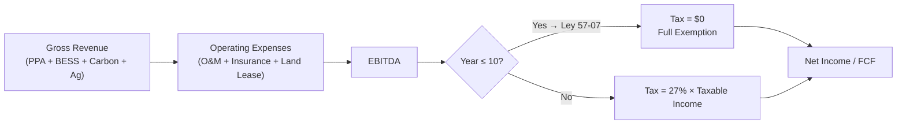

# Ley 57-07 — Incentives Applicability Memo

> **Classification: CONFIDENTIAL — This memo requires review and confirmation by qualified DR tax counsel before inclusion in any offering document or credit submission.**

## Purpose

This memo documents the applicability of Dominican Republic **Law 57-07** (Ley de Incentivo al Desarrollo de Fuentes Renovables de Energía y de sus Regimenes Especiales) to the SunFarm PV project and identifies which specific incentives apply to the project's classification and timeline.

---

## Law 57-07: Summary

### Overview

Law 57-07 was enacted in 2007 to promote the development of renewable energy sources in the Dominican Republic. It provides a comprehensive incentive framework including tax exemptions, customs duty waivers, and investment credits.

### Authoritative Sources

| Source | Description |
|---|---|
| **PwC DR Tax Summary** | Confirms Law 57-07 provides "significant incentives" for renewables; references 40% investment credit for self-producers (context-dependent applicability) |
| **U.S. International Trade Administration** | Notes headline incentives (tariff exemptions, tax exemptions) and flags historical modifications to the law |
| **Green Finance Platform** | Consolidates incentive intent, history, and detailed provisions |

**Citations:**
- PwC: [Dominican Republic — Tax Credits and Incentives](https://taxsummaries.pwc.com/dominican-republic/corporate/tax-credits-and-incentives)
- ITA: [Dominican Republic — Renewable Energy](https://www.trade.gov/country-commercial-guides/dominican-republic-renewable-energy)
- GFP: [Law 57-07 on Incentives for Development of Renewable Energy Sources](https://www.greenfinanceplatform.org/policies-and-regulations/law-57-07-incentives-development-renewable-energy-sources-and-its-special)

---

## Applicable Incentives

### ⚠️ ASSUMPTION: The following is a good-faith interpretation based on published summaries. Final applicability must be confirmed with DR legal counsel and the DGII.

### 1. Corporate Income Tax Exemption

| Parameter | Value |
|---|---|
| **Exemption** | 100% corporate income tax exemption |
| **Duration** | 10 years from COD |
| **DR Corporate Rate** | 27% |
| **Estimated Value** | Significant — see financial model (Years 1–10 show zero tax burden) |
| **Applicable To** | Net income derived from renewable energy generation |

**Model Treatment:** `config/project.js` → `ASSUMPTIONS.tax_exemption_years = 10` and `ASSUMPTIONS.tax_rate = 0.27`

### 2. Import Duty Exemption

| Parameter | Value |
|---|---|
| **Exemption** | Customs duty exemption on equipment, machinery, and materials for construction |
| **Coverage** | PV modules, inverters, BESS equipment, transformers, structural steel, cabling |
| **ITBIS (VAT)** | Exemption may apply (verify current status — modifications have occurred) |
| **Estimated Value** | 15–20% of imported equipment CAPEX |

### 3. Transfer Tax Exemption

| Parameter | Value |
|---|---|
| **Exemption** | Transfer tax exemption on transactions related to the renewable energy project |
| **Relevance** | Land transfers, SPV restructuring, asset disposition |

### 4. Investment Tax Credit (Self-Producers)

| Parameter | Value |
|---|---|
| **Credit** | Up to 40% of investment cost |
| **Applicability** | ⚠️ Context-dependent — PwC notes this applies to "self-producers" |
| **SunFarm Status** | SunFarm is a **grid-connected generator**, not a self-producer. Applicability of the 40% credit to utility-scale grid projects requires counsel confirmation |
| **Treatment** | **NOT included in financial model** — conservative approach |

---

## Key Conditions & Requirements

### To Claim Incentives

1. **CNE Concession** — Must hold valid concession (✅ CNE-CD-003-2023 granted)
2. **CNE Registration** — Project must be registered with CNE's renewable energy registry
3. **Equipment Certification** — Imported equipment must be certified as renewable energy equipment
4. **DGII Compliance** — Entity must be current with all tax filings and obligations
5. **Local Content** — Some incentives may require minimum local content thresholds (verify)
6. **Environmental Compliance** — Must hold valid environmental license (✅ License 0379-20)

### Historical Modifications

The ITA source specifically notes that **Law 57-07 has been modified historically**. Key considerations:

- **Decreto 202-08**: Implementing regulations for Ley 57-07
- **Decreto 717-08**: Additional implementing regulations
- **Decreto 517-25**: BESS mandate for renewable projects (2025) — adds storage requirement but does not modify incentive structure
- **Potential future modifications**: Monitor CNE and DGII bulletins

---

## Financial Model Integration

### How Ley 57-07 Enters the Cash Flow Model

### Sensitivity Impact

| Scenario | Tax Treatment | Levered IRR |
|---|---|---|
| **Base Case** | 10-year exemption + 27% thereafter | 43.3% |
| **No Exemption** | 27% from Year 1 | ~32% (estimated) |
| **Extended Exemption (15yr)** | If policy extends | ~47% (estimated) |

> The tax exemption is a material value driver. Any modification to Ley 57-07's applicability to the project would require model re-run and investor notification.

---

## Counsel Action Items

- [ ] Confirm 10-year income tax exemption applies to utility-scale grid-connected PV under current Ley 57-07
- [ ] Confirm import duty exemption scope (ITBIS / VAT treatment)
- [ ] Determine if 40% investment credit applies to grid-connected projects (not just self-producers)
- [ ] Obtain DGII confirmation letter or ruling for the project entity (RNC 1-31-94471-1)
- [ ] Confirm no retroactive modifications affect projects with existing concessions
- [ ] Document any local content or Dominican participation requirements
- [ ] Prepare tax incentive applicability opinion letter for credit committee package

---

## Risk Assessment

| Risk | Probability | Impact | Mitigation |
|---|---|---|---|
| Ley 57-07 modification reducing benefits | Low-Medium | High | Existing concession + constitutional non-retroactivity principle |
| DGII denial of specific incentive claim | Low | Medium | Pre-application consultation, counsel coordination |
| ITBIS interpretation change | Medium | Low-Medium | Conservative CAPEX budgeting (include contingency) |
| 40% credit inapplicability | High | None | Already excluded from base model |

---

*This memo is a working document for internal structuring and diligence preparation. It does not constitute legal or tax advice. All incentive claims must be validated by qualified Dominican Republic counsel and confirmed with DGII prior to inclusion in any investor communication.*
