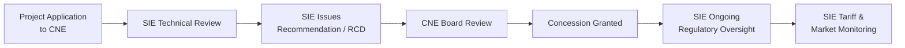

# SIE Resolution Index

> **Classification: CONFIDENTIAL — Diligence Reference**

## Overview

The Superintendencia de Electricidad (SIE) is the Dominican Republic's electricity sector regulator. SIE issues technical recommendations, resolutions, and regulatory opinions that are prerequisites for CNE concession decisions.

**SIE Website:** [https://sie.gob.do](https://sie.gob.do)

---

## SunFarm-Specific Resolutions

### SIE-119-2022-RCD — Definitive Concession Recommendation

| Field | Detail |
|---|---|
| **Document** | SIE-119-2022-RCD |
| **Subject** | Recommendation for definitive concession — Sunfarming Food & Energy 50 MW |
| **Type** | Regulatory recommendation to CNE |
| **Year** | 2022 |
| **Outcome** | Favorable recommendation → CNE-CD-003-2023 granted |

**Source:** [SIE Document — SIE-119-2022-RCD](https://sie.gob.do/document/https-sie-gob-do-wp-content-uploads-2022-11-sie-119-2022-rcd-rec-cne-cd-sunfarmimg-food-energy-de-50mw-2-pdf/)

### Significance for Diligence

- SIE's recommendation is a **prerequisite** for CNE to issue a definitive concession
- The recommendation confirms that SIE conducted a technical, financial, and regulatory review of the project
- This document demonstrates that the project passed the independent regulatory gate required under Dominican electricity law

---

## SIE Regulatory Framework

### Applicable Legislation

| Law | Description | Relevance |
|---|---|---|
| **Ley 125-01** | General Electricity Law | Establishes SIE authority, market structure, concession framework |
| **Ley 186-07** | Transmission law | ETED obligations, interconnection rights |
| **Ley 57-07** | Renewable energy incentives | Tax exemptions, customs benefits, concession preferences |
| **Decreto 202-08** | Ley 57-07 implementing regulations | Procedural requirements for concessions |
| **Decreto 717-08** | Additional Ley 57-07 regulations | Technical standards, interconnection procedures |
| **Decreto 517-25** | BESS mandate for renewables | Storage requirements for new projects |

### SIE Role in Project Lifecycle

---

## Additional SIE Interactions Required

| Interaction | Timing | Status |
|---|---|---|
| Interconnection technical review | Pre-construction | Via ETED coordination |
| Market participant registration | Pre-COD | Pending |
| Metering and settlement enrollment | Pre-COD | Pending |
| Ancillary services qualification (BESS) | Pre-COD / ongoing | Pending |
| Annual compliance reporting | Post-COD, annual | Future |
| Tariff / rate proceedings | Periodic | Monitoring |

---

## Data Room Cross-References

| Ref | Document | Location |
|---|---|---|
| C-002 | SIE-119-2022-RCD full document | data-room/ |
| C-001 | CNE-CD-003-2023 (resulting concession) | data-room/ |
| D-001 | ETED no-objection letter | data-room/ |

---

*Structured for regulatory annex of credit committee submissions.*
