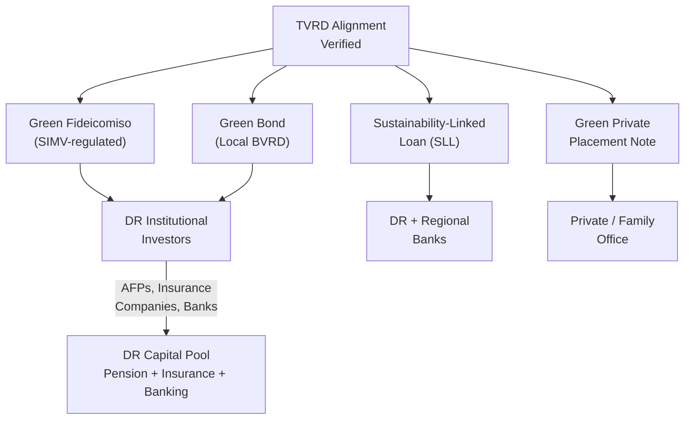

# Taxonomía Verde RD — Alignment Assessment

> **Classification: CONFIDENTIAL — Capital Markets Structuring**

## Purpose

This document assesses the SunFarm PV project's alignment with the **Taxonomía Verde de la República Dominicana (TVRD)** — the national green classification framework — for purposes of green bond issuance, fideicomiso labeling, and sustainability-linked financing in the Dominican capital markets.

---

## TVRD Overview

### What Is the Taxonomía Verde RD?

The TVRD is the Dominican Republic's official **green taxonomy** — a national classification framework that defines which economic activities and investments qualify as "green" or "sustainable" for purposes of the Dominican financial markets.

| Attribute | Detail |
|---|---|
| **Full Name** | Taxonomía Verde de la República Dominicana |
| **Issuing Authorities** | SIMV (Superintendencia del Mercado de Valores) + Ministerio de Medio Ambiente |
| **Purpose** | Classify eligible green activities for Dominican capital markets instruments |
| **Legal Basis** | SIMV regulatory resolution |
| **Equivalent** | Functions similarly to the EU Taxonomy for Sustainable Finance |

### Authoritative Sources

| Source | Description |
|---|---|
| **SIMV Taxonomy Page** | Official regulatory page with resolution and taxonomy documentation |
| **Taxonomy PDF** | Full classification document published by SIMV + Ministry of Environment |

**Citations:**
- SIMV: [Taxonomía Verde RD](https://simv.gob.do/normativas/taxonomia-verde-rd/)
- Ministry of Environment: [Taxonomía Verde de la República Dominicana (PDF)](https://ambiente.gob.do/app/uploads/2024/06/Taxonomia-Verde_RD_V2-OK.pdf)

---

## Alignment Assessment

### Solar PV Generation — TVRD Category

| Criterion | Assessment | Status |
|---|---|---|
| **Activity Classification** | Electricity generation from solar photovoltaic sources | ✅ Eligible |
| **Climate Mitigation** | Displaces fossil fuel generation; ~63,000 tCO₂/yr avoided | ✅ Substantial contribution |
| **Do No Significant Harm** | Environmental license 0379-20 granted; EIA approved | ✅ Satisfied |
| **Minimum Safeguards** | Labor law compliance, land title clear, no displacement | ✅ Satisfied |

### Battery Energy Storage — TVRD Category

| Criterion | Assessment | Status |
|---|---|---|
| **Activity Classification** | Battery energy storage supporting renewable integration | ✅ Eligible |
| **Grid Services** | Frequency regulation, peak shaving, curtailment mitigation | ✅ Enabling activity |
| **Technology** | LFP chemistry — no cobalt supply chain risk | ✅ Compliant |

### Agrivoltaic Component — TVRD Category

| Criterion | Assessment | Status |
|---|---|---|
| **Activity Classification** | Agricultural production combined with renewable energy | ✅ Eligible (dual classification) |
| **Land Use** | Productive agricultural use maintained on solar site | ✅ Aligned |
| **Food Security** | Contributes to national food production goals | ✅ Positive impact |

---

## TVRD vs. International Frameworks

### Cross-Reference

| Framework | SunFarm Alignment | Notes |
|---|---|---|
| **TVRD** (DR national) | ✅ Fully aligned | Primary framework for DR issuances |
| **ICMA GBP** (global) | ✅ Fully aligned | See `capital/green-bond/icma-alignment.md` |
| **EU Taxonomy** | ✅ Substantially aligned | Solar PV + BESS qualify under EU criteria |
| **CBI Standard** | ✅ Eligible | Climate Bonds Initiative solar criteria met |
| **SDG Alignment** | ✅ SDGs 7, 8, 9, 13, 15 | Affordable clean energy, decent work, industry, climate action, life on land |

---

## Capital Markets Application

### How TVRD Enables DR Capital Raising

### Why This Matters

1. **SIMV has already approved a "green" market instrument** — the Fideicomiso de Oferta Pública de Valores **Larimar I** was approved as the first green fixed-income security in the DR
   - Source: [SIMV — Larimar I Green Approval](https://simv.gob.do/superintendencia-del-mercado-de-valores-aprueba-primer-valor-verde-de-renta-fija-en-la-republica-dominicana-del-fideicomiso-de-oferta-publica-de-valores-larimar-i-no-04-fp/)
2. **Precedent exists** — SunFarm can follow the same pathway
3. **DR pension funds (AFPs)** are mandated to deploy to local instruments — green labeling makes SunFarm eligible for AFP allocation

---

## TVRD Compliance Checklist

| Requirement | Status | Evidence |
|---|---|---|
| Activity eligible under TVRD | ✅ | Solar PV, BESS, agrivoltaics all covered |
| Substantial contribution to climate mitigation | ✅ | ~63,000 tCO₂/yr displacement |
| Do No Significant Harm (DNSH) | ✅ | EIA approved, license 0379-20 |
| Minimum social safeguards | ✅ | No displacement, local employment |
| Use of proceeds ringfenced | ⬜ Pending | Requires fideicomiso / bond structure |
| Impact reporting framework | ⬜ Pending | Annual reporting plan needed |
| External verification / SPO | ⬜ Pending | SPO provider to be engaged |

---

## Recommended Actions

1. **Engage SIMV early** — informal consultation on green labeling eligibility
2. **Obtain Second Party Opinion (SPO)** — from recognized provider (Sustainalytics, Vigeo Eiris, or local equivalent)
3. **Prepare Use-of-Proceeds Framework** — ringfence $55M CAPEX allocation
4. **Draft Impact Reporting Template** — annual disclosure (generation, emissions avoided, employment, agricultural output)
5. **Cross-reference ICMA GBP** — ensure dual alignment (TVRD + ICMA) for both local and international credibility
6. **Monitor TVRD updates** — taxonomy is evolving; ensure alignment with latest version

---

*This assessment is based on published TVRD documentation and publicly available SIMV guidance. Formal TVRD alignment confirmation should be obtained through SIMV review or qualified SPO engagement.*
